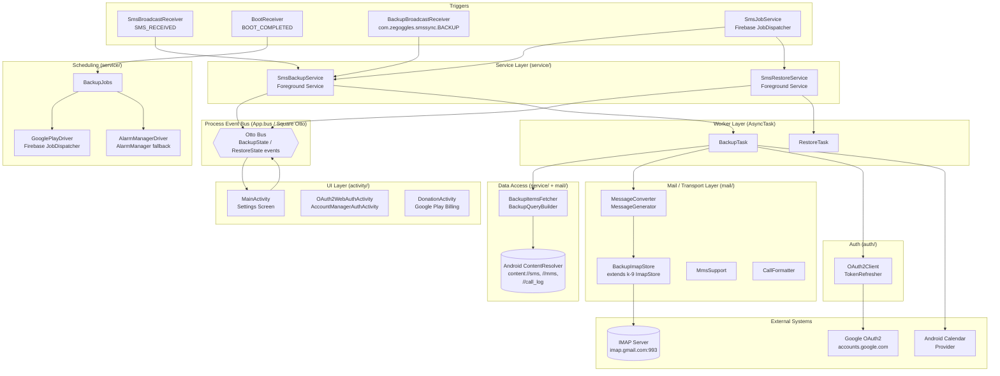

# Project Overview: SMS Backup+

**Assessment:** 20260529-modernization
**Step:** 1.1 — Project Overview Discovery
**Date:** 2026-05-29
**Analyst:** Developer Agent (Claude Sonnet 4.6)

---

## Project Overview

- **Name:** SMS Backup+
- **Type:** Android mobile application (native, single-module)
- **Domain:** Personal data backup and archival — mobile messaging and call-log preservation
- **Primary Language:** Java (source/target compatibility Java 8)
- **Framework(s):** Android SDK (compileSdk 29, targetSdk 29, minSdk 14), AndroidX Preference, Square Otto event bus, k-9 mail library (IMAP), Firebase JobDispatcher

---

## Purpose Statement

SMS Backup+ is an Android application that backs up SMS messages, MMS messages, and call logs from a device to a user-supplied Gmail/IMAP mailbox. It also supports restoring SMS and call logs back to the phone, and optionally writing call-log entries to a Google Calendar. The app is a fork of the now-defunct "SMS Backup" project and has been maintained as a free, open-source tool distributed via Google Play and F-Droid; it explicitly operates in maintenance mode with no new features planned.

Evidence: `README.md` lines 13–37; `sdlc/artifacts/engagement/code-location.md` "What It Is" section.

---

## Technology Stack

| Category | Technology | Version (if known) |
|----------|------------|--------------------|
| Language | Java | Source/target Java 8 (`app/build.gradle` line 52–53) |
| Platform | Android SDK | compileSdk 29, minSdk 14, targetSdk 29 (`app/build.gradle` lines 10–12) |
| Build system | Gradle (Kotlin-flavoured Groovy DSL) | AGP 4.1.3 (`build.gradle` line 5) |
| Build tools | Android Build Tools | 29.0.2 (`app/build.gradle` line 11) |
| Event bus | Square Otto | 1.3.8 (`app/build.gradle` line 57) |
| IMAP client | k-9 mail library (custom fork) | commit `eaf689025e` (`app/build.gradle` line 58) |
| Background jobs | Firebase JobDispatcher | 0.8.6 (`app/build.gradle` line 60) |
| Job fallback | Android AlarmManager | Platform API (no version) |
| Billing | Google Play Billing | 2.1.0 (`app/build.gradle` line 59) |
| UI / Settings | AndroidX PreferenceFragmentCompat | 1.1.0 (`app/build.gradle` line 62) |
| Testing (runner) | JUnit 4 | 4.12 (`app/build.gradle` line 65) |
| Testing (Android) | Robolectric | 4.3.1 (`app/build.gradle` line 66) |
| Testing (assertions) | Google Truth | 0.39 (`app/build.gradle` line 67) |
| Testing (mocking) | Mockito | 1.10.17 (`app/build.gradle` line 68) |
| CI | Travis CI | `.travis.yml` / badge in `README.md` (no workflow YAML present in repo) |
| Store metadata | Fastlane-compatible layout | `metadata/` module |
| Auth (OAuth2) | Raw `HttpsURLConnection` | Platform API (`auth/OAuth2Client.java`) |

> Note: No `.github/workflows/*.yml` files are present in the repository; CI is Travis CI as evidenced by the Build Status badge in `README.md`. A single `.github/ISSUE_TEMPLATE/500_bug_report.yml` exists for issue tracking only.

---

## Project Structure

```
.                                   # Repo root
├── app/                            # P01 — sole runtime Android module
│   ├── build.gradle                # App-level Gradle config (AGP, deps, lint, signing)
│   ├── proguard-rules.pro          # ProGuard/R8 rules (release minification off)
│   └── src/
│       ├── main/
│       │   ├── AndroidManifest.xml # App manifest — activities, services, receivers
│       │   ├── java/com/zegoggles/smssync/
│       │   │   ├── App.java        # Application subclass; Otto bus singleton; notification channel
│       │   │   ├── Consts.java     # URI constants for SMS/MMS/CallLog content providers
│       │   │   ├── MmsConsts.java  # MMS-specific URI/column constants
│       │   │   ├── activity/       # UI layer: settings screens, auth flows, donation
│       │   │   │   ├── auth/       # OAuth2 web + AccountManager auth activities
│       │   │   │   ├── donation/   # Google Play Billing donation flow
│       │   │   │   ├── events/     # Otto event POJO types (UI events)
│       │   │   │   └── fragments/  # PreferenceFragmentCompat settings screens
│       │   │   ├── auth/           # OAuth2 token exchange, refresh, storage
│       │   │   ├── calendar/       # Device Calendar provider read/write (API-level split)
│       │   │   ├── compat/         # API-level shims: default-SMS-app role stubs
│       │   │   ├── contacts/       # Contacts provider: phone→name lookup, group filtering
│       │   │   ├── mail/           # IMAP store + SMS/MMS/calllog ↔ RFC-822 conversion
│       │   │   ├── preferences/    # SharedPreferences facade + typed accessors
│       │   │   ├── receiver/       # Broadcast receivers: SMS, boot, package-replaced
│       │   │   ├── service/        # Backup/restore engine, scheduling, state machine
│       │   │   │   ├── exception/  # Typed, localizable exception hierarchy
│       │   │   │   └── state/      # Immutable state value objects + SmsSyncState enum
│       │   │   ├── tasks/          # AsyncTask wrapper for OAuth2 callback
│       │   │   └── utils/          # AppLog, BundleBuilder, Drawables, thread helpers
│       │   └── res/                # Android resources
│       │       ├── values/         # Default strings, styles, prefs
│       │       ├── values-ca/      # Catalan
│       │       ├── values-cs/      # Czech
│       │       ├── values-da/      # Danish
│       │       ├── values-de/      # German
│       │       ├── values-es/      # Spanish
│       │       ├── values-fr/      # French
│       │       ├── values-gl/      # Galician
│       │       ├── values-gr/      # Greek
│       │       ├── values-hu/      # Hungarian
│       │       ├── values-it/      # Italian
│       │       ├── values-ko/      # Korean
│       │       ├── values-nb-rNO/  # Norwegian
│       │       ├── values-nl/      # Dutch
│       │       ├── values-pl/      # Polish
│       │       ├── values-pt-rPT/  # Portuguese
│       │       ├── values-ru/      # Russian
│       │       ├── values-sk/      # Slovak
│       │       ├── values-sq/      # Albanian
│       │       ├── values-sr/      # Serbian
│       │       ├── values-sv/      # Swedish
│       │       ├── values-tr/      # Turkish
│       │       ├── values-uk/      # Ukrainian
│       │       ├── values-zh-rCN/  # Chinese (Simplified)
│       │       └── values-zh-rTW/  # Chinese (Traditional)
│       └── test/
│           └── java/com/zegoggles/smssync/
│               └── [36 test files, mirroring main package structure]
├── metadata/                       # P02 — store listing (Fastlane / Play Store)
│   ├── build.gradle                # Stub (not part of runtime build)
│   ├── f-droid/                    # F-Droid metadata text
│   └── play/                       # Play Store screenshots + icon assets (SVG, PNG, Sketch)
├── build.gradle                    # Root Gradle: AGP classpath, repo config
├── settings.gradle                 # Module includes: ':app', ':metadata'
├── gradle.properties               # Gradle daemon / JVM settings
├── gradle/wrapper/                 # Gradle wrapper (gradlew / gradlew.bat)
├── BUGS.md                         # Known issues tracker
├── CHANGES                         # Changelog
├── COPYING                         # Apache 2.0 licence
├── NOTICE                          # Attribution notices
└── README.md                       # User documentation + FAQ
```

Evidence: directory listing via Glob; `settings.gradle` line 1; `app/build.gradle`; `README.md`.

---

## Architecture Pattern

The application follows a **layered, event-driven Android service architecture** with no external project-owned server component. The key patterns identified are:

### 1. Layered Architecture (5 layers)

| Layer | Key Classes | Responsibility |
|-------|-------------|----------------|
| **Trigger** | `SmsBroadcastReceiver`, `BootReceiver`, `PackageReplacedReceiver`, `BackupBroadcastReceiver` | Detect system events and launch backup service |
| **Orchestration / Service** | `SmsBackupService`, `SmsRestoreService`, `SmsJobService`, `ServiceBase` | Foreground services that own lifecycle, wake locks, notifications |
| **Worker / Task** | `BackupTask`, `RestoreTask` (both extend `AsyncTask`) | Off-main-thread backup/restore execution; post progress via Otto bus |
| **Data access** | `BackupItemsFetcher`, `BackupCursors`, `BackupQueryBuilder`, `BulkFetcher` | Android ContentResolver cursor reads from SMS/MMS/CallLog providers |
| **Transport / Conversion** | `BackupImapStore`, `MessageConverter`, `MessageGenerator`, `MmsSupport`, `CallFormatter` | RFC-822 message encoding and IMAP I/O via k-9 mail library |

Evidence: `service/SmsBackupService.java` (orchestration/worker delegation); `service/BackupTask.java` (AsyncTask pattern); `mail/BackupImapStore.java` and `mail/MessageConverter.java` (transport layer).

### 2. Event Bus (Square Otto)

`App.bus` is a process-global singleton (`App.java` line 59: `private static final Bus bus = new Bus()`). Services post `BackupState`/`RestoreState` immutable value objects; `MainActivity` subscribes. `@Produce` annotations in `SmsBackupService` and `SmsRestoreService` allow late subscribers to receive the last-known state without missing events.

Evidence: `App.java` lines 39, 59, 116–134; `service/SmsBackupService.java` line 202 (`@Produce`).

### 3. Immutable State Machine

`SmsSyncState` enum (11 states: `INITIAL`, `CALC`, `LOGIN`, `BACKUP`, `RESTORE`, `ERROR`, `CANCELED_BACKUP`, `CANCELED_RESTORE`, `FINISHED_BACKUP`, `FINISHED_RESTORE`, `UPDATING_THREADS`) drives transitions in `State.transition(SmsSyncState, Exception)` producing new immutable `BackupState`/`RestoreState` instances. Mutable state is never shared across threads.

Evidence: `service/state/SmsSyncState.java` (full enum); `service/SmsBackupService.java` lines 206–226 (`@Subscribe backupStateChanged`).

### 4. Dual-Mode Scheduling

`BackupJobs` selects between `GooglePlayDriver` (Firebase JobDispatcher — primary, GCM-backed) and `AlarmManagerDriver` (legacy fallback) based on `Preferences.isUseOldScheduler()` and Google Play Services availability. The scheduling abstraction is transparent to the rest of the codebase.

Evidence: `App.java` lines 79–85; `service/BackupJobs.java` (referenced in solution-inventory.md).

### 5. SharedPreferences Facade

`Preferences` and `AuthPreferences` provide fully typed accessors over `PreferenceManager.getDefaultSharedPreferences()`. All preference keys are declared as `DataType.PreferenceKeys` and `enum Keys` entries, preventing magic-string scattering.

Evidence: `preferences/Preferences.java`; `mail/DataType.java` lines 67–83 (`PreferenceKeys` inner class).

### 6. API-Level Compatibility Shims

`CalendarAccessorPost40` vs. `CalendarAccessorPre40` isolate Calendar API differences; the `compat` package provides default-SMS-app role stubs (`SmsReceiver`, `MmsReceiver`, `ComposeSmsActivity`, `HeadlessSmsSendService`) required for KitKat+ restore permission flow.

Evidence: `calendar/CalendarAccessorPost40.java`, `calendar/CalendarAccessorPre40.java`; `compat/` package (solution-inventory.md package map).

---

## High-Level Architecture Diagram



---

## Entry Points

| Entry Point | Type | File | Purpose |
|-------------|------|------|---------|
| `MainActivity` | LAUNCHER Activity | `activity/MainActivity.java` | Settings UI; manual backup/restore trigger |
| `SmsBackupService` | Foreground Service | `service/SmsBackupService.java` | Backup engine; started by receivers, job service, or UI |
| `SmsRestoreService` | Foreground Service | `service/SmsRestoreService.java` | Restore engine; started by UI |
| `SmsJobService` | Firebase `JobService` | `service/SmsJobService.java` | Scheduled job entry point (Firebase JobDispatcher) |
| `SmsBroadcastReceiver` | BroadcastReceiver | `receiver/SmsBroadcastReceiver.java` | Trigger on incoming SMS |
| `BootReceiver` | BroadcastReceiver | `receiver/BootReceiver.java` | Re-schedule backup jobs after device boot |
| `PackageReplacedReceiver` | BroadcastReceiver | `receiver/PackageReplacedReceiver.java` | Re-schedule after app update |
| `BackupBroadcastReceiver` | BroadcastReceiver | `receiver/BackupBroadcastReceiver.java` | Third-party `com.zegoggles.smssync.BACKUP` intent |
| `OAuth2WebAuthActivity` | Activity | `activity/auth/OAuth2WebAuthActivity.java` | OAuth2 browser-based auth flow |
| `AccountManagerAuthActivity` | Activity | `activity/auth/AccountManagerAuthActivity.java` | AccountManager token retrieval |
| `App` | Application | `App.java` | Process entry point: bus init, notification channel, scheduler, k-9 config |

Evidence: `App.java`; `service/SmsBackupService.java`; `sdlc/analysis/20260529-modernization/inputs/solution-inventory.md` (Android Manifest Components table).

---

## Key Observations

### KO-01: Maintenance-Mode Codebase with Accumulated Technical Debt
The README explicitly states "SMS Backup+ is in maintenance mode; no new features will be added." (`README.md` line 226–228). The `BUGS.md` documents four persistent, unresolved issues including Gmail XOAuth2 breakage (policy change since 2019), MMS misattribution on some devices, and a setting that causes complete backup failure on modern Android versions.

### KO-02: Deprecated AsyncTask as Core Concurrency Primitive
`BackupTask extends AsyncTask<BackupConfig, BackupState, BackupState>` and `RestoreTask extends AsyncTask<RestoreConfig, RestoreState, RestoreState>` (`service/BackupTask.java` line 50). `AsyncTask` was deprecated in Android API 30 (Android 11) and removed in API 33. The application's `targetSdkVersion 29` (`app/build.gradle` line 13) has not been updated since Android 10, delaying manifest enforcement of the deprecation but exposing a critical modernization gap.

### KO-03: Firebase JobDispatcher is Discontinued
`com.firebase:firebase-jobdispatcher:0.8.6` (`app/build.gradle` line 60) was officially discontinued by Google in 2019 in favour of `WorkManager`. The app carries an `AlarmManagerDriver` fallback but its primary job scheduling path relies on a library with no future support. The `build.gradle` root comment at line 26 explicitly notes: "This is the only repo that seems to be hosting `com.firebase:firebase-jobdispatcher` in 2024," confirming supply-chain fragility.

### KO-04: SDK Level Freeze at API 29 (Android 10)
`compileSdk`, `targetSdk`, and `buildToolsVersion` are all at API 29 / 29.0.2 (`app/build.gradle` lines 10–11). Android 10 reached end of support in 2022. Targeting API 29 means the app cannot access Android 12+ exact-alarm APIs, misses Android 13+ notification permission requirements, and will not benefit from OS-level battery-optimisation improvements. Google Play's current minimum target requirement (API 34 as of late 2024) would block publishing updates.

### KO-05: XOAuth2 IMAP Broken by Google Policy
Since June 2019 Google prohibits XOAuth2 for IMAP message storage. The Gmail IMAP path now requires an application password. `OAuth2Client.java` and the auth flow remain in the codebase but are effectively non-functional for the primary backup use case (`README.md` lines 24–29; `BUGS.md` issue 1; `sdlc/artifacts/engagement/endpoints.md` policy note).

### KO-06: Pinned Dependency on a Custom k-9 Mail Fork at a Git SHA
The IMAP client dependency is `com.github.jberkel.k-9:k9mail-library:eaf689025e` (`app/build.gradle` line 58) — a specific commit on a private fork hosted on JitPack. This is not a stable release version; the upstream k-9 project (now Thunderbird for Android) has diverged significantly. Any JitPack outage or GitHub repository deletion would break the build. `build.gradle` root line 26 already calls out a special repository required to resolve `firebase-jobdispatcher`, indicating prior build-reproducibility issues.

### KO-07: Strong Test Coverage Foundation
36 Robolectric/JUnit test files cover all major packages (service, mail, auth, preferences, receiver, calendar, contacts). Test files mirror the production package structure exactly under `app/src/test/java/com/zegoggles/smssync/`. This provides a usable safety net for modernization refactoring.

Evidence: Glob of `app/src/test/java/com/zegoggles/smssync/**/*.java` returning 36 files.

### KO-08: No CI Workflow in Repository
No `.github/workflows/*.yml` files exist (Glob confirmed zero results). The CI badge in `README.md` references Travis CI (`travis-ci.com`), which has significantly reduced its free tier. The absence of a reproducible CI definition in the repository is a build-stability concern for any modernization effort.

### KO-09: 25 Localisations Present
The `app/src/main/res/` directory contains 25 `values-*` locale directories covering ca, cs, da, de, es, fr, gl, gr, hu, it, ko, nb-rNO, nl, pl, pt-rPT, ru, sk, sq, sr, sv, tr, uk, zh-rCN, zh-rTW, plus the default `values/`. Any API or string changes during modernization must account for translation surface area.

### KO-10: No Project-Owned Backend
The application is entirely on-device; it integrates directly with Google (OAuth2, IMAP, Contacts, Calendar) and any user-supplied IMAP server. There is no microservice layer to modernize on the server side.

Evidence: `sdlc/artifacts/engagement/systems.md` "No server-side component owned by the project"; `sdlc/artifacts/engagement/endpoints.md`.

---

## Technology Stack Verification

| Claim | Evidence File | Evidence |
|-------|--------------|----------|
| Java primary language | `app/build.gradle` lines 52–53 | `sourceCompatibility JavaVersion.VERSION_1_8` |
| Square Otto event bus | `App.java` line 39 | `import com.squareup.otto.Bus;` |
| k-9 mail library | `service/BackupTask.java` line 8 | `import com.fsck.k9.mail.AuthenticationFailedException;` |
| Firebase JobDispatcher | `service/SmsBackupService.java` line 27 | `import com.firebase.jobdispatcher.Job;` |
| AndroidX Preference | `activity/fragments/MainSettings.java` (implied by solution-inventory) | `PreferenceFragmentCompat` subclass |
| JUnit + Robolectric test stack | `app/build.gradle` lines 65–68 | `testImplementation` declarations |

---

## Questions for Further Investigation

1. **AsyncTask migration path**: What is the most pragmatic replacement for `BackupTask`/`RestoreTask` given the existing Otto-bus progress-reporting contract — `WorkManager` + `LiveData`, coroutines, or `ExecutorService` with a `Handler`? Does the `@SuppressLint("StaticFieldLeak")` on `BackupTask` indicate a real leak risk with the current service lifecycle?

2. **WorkManager migration scope**: Can Firebase JobDispatcher be replaced with `WorkManager` in a single step, or does `AlarmManagerDriver` need to be preserved for older devices (minSdk 14 = Android 4.x)? WorkManager's minimum SDK is 14, so in principle it can replace both paths.

3. **Gmail authentication viability**: Is OAuth2 + IMAP app-password the long-term supported path, or should the app migrate to the Gmail REST API? The current IMAP path requires users to generate app passwords manually, which is a poor UX; can the Gmail API restore programmatic access?

4. **targetSdk upgrade blocklist**: Which API surface areas (exact alarms, `READ_PHONE_STATE`, notification permissions, `ContentProvider` query changes in API 30+) would require code changes before `targetSdkVersion` can be safely raised to 34?

5. **k-9 library fork**: Is there a viable upgrade path to an official k-9 / Thunderbird library release, or should the IMAP layer be re-implemented using a maintained library (e.g., Jakarta Mail / Angus Mail)?

6. **MMS restore gap**: The README notes MMS restore is not supported (`README.md` line 21). Is this a hard technical blocker (carrier-dependent encoding) or a prioritisation decision? This affects the completeness of any modernization scope definition.

7. **Test coverage completeness**: The 36 test files cover major packages, but are there integration tests or end-to-end tests covering the full backup pipeline (ContentProvider → MessageConverter → IMAP)? Manual review of `BackupTaskTest.java` and `MessageConverterTest.java` is needed to characterise depth.

8. **ProGuard / R8 disabled**: `minifyEnabled false` is set for the release build (`app/build.gradle` line 34). Was this intentional (to ease debugging)? Enabling minification would reduce APK size and may be a modernization quick-win.

---

## Limitations of This Analysis

1. Runtime behavior (actual IMAP server responses, OAuth2 token refresh success/failure, Android ContentProvider cursor contents) was not observable — this is a static analysis only.
2. The accuracy of README documentation relative to the current codebase has not been fully verified; it may describe behaviours that were changed without documentation updates.
3. Instrumented/end-to-end test coverage (if any) was not assessed — only Robolectric JVM unit tests were enumerated.
