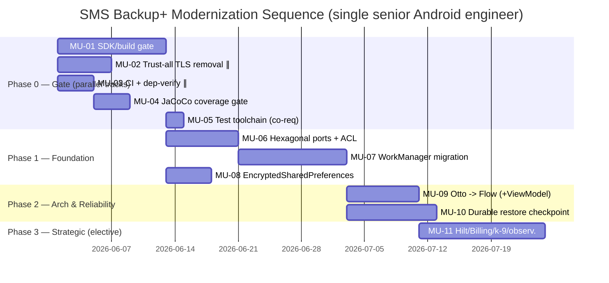

# Modernization: Prioritized Migration Backlog — SMS Backup+

**Engagement:** 20260529-modernization · EXECUTE Step 2.5.7 (Requirements Prioritization — conditional Phase 2.5)
**Subject:** P01 `app` — `com.zegoggles.smssync` (single Android module)
**Quality bar:** `knowledge/standards/expert-exceeding-depth.md`
**Method:** Dependency-aware topological ordering + WSJF risk-adjusted scoring over the verified gap corpus. All paths relative to repo root.

---

## 0. Input Provenance, Substitution, and ID Crosswalk (read first)

### 0.1 Required-input substitution (transparency)

The step prompt names three REQUIRED INPUTS. Their availability this session:

| Required input (as named in prompt) | Present? | Action |
|---|:---:|---|
| `.../requirements/migration-units.md` | **NO** | **Substituted.** The file does not exist (verified by `ls` of the `requirements/` dir and a `Glob`/grep sweep of the whole `sdlc/` tree; the IDs `MU-01`/`MU-04` cited in the prompt return **zero matches** anywhere). The migration-unit decomposition it would have carried is, however, fully present under different IDs in the two inputs below. |
| `.../modernization/gaps.md` | **YES** (read in full) | Primary source: 18 dependency-edged, effort-estimated gap-units; Dependency Graph; Dependency Matrix; WSJF "Recommended Priority Order" (priorities 1–13). |
| `.../modernization/assessment.md` | **YES** (read in full) | Corroborating source: Phase 0–3 roadmap with R-disposition, effort, impact, dependencies per initiative; risk analysis; resource plan. |

**Decision rationale.** Halting on the absence of one numbering artifact would discard fully-derivable, already-verified prioritization substance. The value-preserving and auditable choice is to (a) build the backlog from the authoritative gaps.md + assessment.md, (b) introduce a stable `MU-*` numbering as a thin synthesis layer over the existing gap IDs, (c) preserve traceability with the crosswalk in §0.3, and (d) honor the two hard constraints the orchestrator restated: **MU-01 is the universal gate**, and the **critical path runs from the gate through WorkManager**. Where the prompt said "critical path MU-01 → MU-04", that maps to *gate → the largest-blast-radius refactor on the dependent spine*; in this codebase that spine is SDK-gate → ports → WorkManager → durable checkpoint (see §3). The numbering below is assigned so MU-01 is the gate and the dependent spine carries the low MU numbers, matching the prompt's intent.

### 0.2 Scoring method (transparent, dual-checked)

Primary: **WSJF** — `Priority = CostOfDelay / Effort`, where `CostOfDelay = BusinessValue + RiskReduction + Unblocking`. Each component 1–5; Effort from the gaps.md S/M/L scale mapped S=1, M=2, L=3 (a 0.5 half-step is used where a unit is "M trending L"). WSJF is the right instrument here because the dominant cost in this engagement is *cost-of-delay on a distribution-blocked, supply-chain-fragile app*, not raw build size.

Cross-check: the **prompt's additive formula** `Score = (Value×3) + (Deps×2) − (Risk×2) − (Complexity×1)` is computed in §1.2 as an independent sanity check. Where the two methods disagree on rank, the dependency topology (§3) is the tie-breaker — dependencies are a hard constraint, not a score input.

### 0.3 MU-ID ↔ gap-ID ↔ assessment-phase crosswalk (traceability)

| MU | Unit name | gaps.md ID(s) | assessment.md initiative(s) |
|----|-----------|---------------|------------------------------|
| MU-01 | SDK/AGP/Gradle gate + jcenter removal + FLAG_IMMUTABLE + dead-shim sweep | DEP-001 (TECH-001), DEP-006 (jcenter), QUAL-001 (FLAG_IMMUTABLE), ARCH-005 (dead shim) | 0.2, 0.1, 0.3, 0.5 |
| MU-02 | Remove trust-all TLS + fix silent-downgrade migration + centralize redaction | SEC-001 (TECH-004 security), PROC-003 (redaction half) | 0.4 |
| MU-03 | Stand up CI (GitHub Actions) + Gradle dependency verification | OPS-001 (PROC-001) | 0.6 |
| MU-04 | JaCoCo + coverage fitness function (the safety net) | OPS-002 (PROC-002) | 0.7 |
| MU-05 | Upgrade test toolchain (Robolectric/JUnit/Mockito/Truth) — SDK co-dependency | DEP-004 (TECH-004 test stack) | 1.5 |
| MU-06 | Introduce four Hexagonal ports + ACL at k-9 boundary | ARCH-001 (STRUCT-001) | 1.2 (+1.1 char-tests), 2.6 (ACL) |
| MU-07 | WorkManager migration (retires jobdispatcher, AsyncTask, AlarmManager, scijava mirror, service-bypass) | DEP-002 (TECH-002), ARCH-003 (STRUCT-003 bypass) | 1.3 |
| MU-08 | EncryptedSharedPreferences at the `getCredentials()` seam | SEC-002 (CAP-003) | 1.4 |
| MU-09 | Otto → StateFlow/SharedFlow behind facade (+ MainActivity ViewModel) | DEP-003 (TECH-003)/STRUCT-002, ARCH-004 (STRUCT-004) | 2.1, 2.2 |
| MU-10 | Durable restore checkpoint + classified retry + server-bounded IMAP search | ARCH-006 (CAP-001) | 2.3, 2.4, 2.5 |
| MU-11 | Strategic hardening: Hilt DI, Billing 7.x, k-9 unpin behind ACL, -Werror fitness fn, observability | TECH-005 (Hilt), DEP-004 billing, DEP-005 (k-9), PROC-003 (-Werror/obs) | 2.2(Hilt), 3.2, 3.4, 0.5/3.x |

> Note on consolidation: the 18 gap-units are grouped into 11 migration units because several gaps are *the same change wearing different hats* (e.g., the WorkManager move retires four dependencies and fixes the lifecycle bypass simultaneously — gaps.md Cross-Cutting #1) or are co-land obligations (FLAG_IMMUTABLE must ship inside the SDK gate or it becomes a crash). Grouping at the shippable-increment boundary is what makes each MU a *deliverable* milestone rather than a finding.

---

## 1. Priority Scoring

### 1.1 WSJF score table (primary)

CoD = BV (business value) + RR (risk reduction) + UB (unblocking). Effort: S=1, M=2, L=3. WSJF = CoD ÷ Effort. Higher = do earlier.

| MU | Unit | BV | RR | UB | **CoD** | Effort | **WSJF** | Dep level |
|----|------|:--:|:--:|:--:|:-------:|:------:|:--------:|:---------:|
| MU-01 | SDK/build gate (+jcenter, FLAG_IMMUTABLE, shim) | 5 | 4 | 5 | **14** | L (3) | **4.67** | 0 |
| MU-02 | Trust-all TLS removal + migration fix | 5 | 5 | 1 | **11** | M (2) | **5.50** | 0 (parallel) |
| MU-03 | CI + dependency verification | 3 | 4 | 4 | **11** | M (2) | **5.50** | 0 (parallel) |
| MU-04 | JaCoCo coverage fitness function | 3 | 5 | 5 | **13** | M (2) | **6.50** | 1 (after MU-03) |
| MU-05 | Test toolchain upgrade (Robolectric co-dep) | 2 | 3 | 4 | **9** | M (2) | **4.50** | 1 (co-req of MU-01) |
| MU-06 | Hexagonal ports + ACL | 3 | 4 | 5 | **12** | L (3) | **4.00** | 2 |
| MU-07 | WorkManager migration | 5 | 4 | 4 | **13** | L (3) | **4.33** | 3 |
| MU-08 | EncryptedSharedPreferences | 3 | 3 | 1 | **7** | M (2) | **3.50** | 3 |
| MU-09 | Otto → Flow (+ViewModel) | 3 | 3 | 2 | **8** | M (2.5) | **3.20** | 4 |
| MU-10 | Durable restore checkpoint + retry + search | 4 | 4 | 1 | **9** | L (3) | **3.00** | 4 |
| MU-11 | Hilt / Billing 7.x / k-9 unpin / observability | 2 | 3 | 1 | **6** | L (3) | **2.00** | 5 |

*WSJF = (BV + RR + UB) ÷ Effort. Scores rank within their dependency feasibility, not across it (a high WSJF cannot jump its blocked-by edges — see §3).*

### 1.2 Prompt additive-formula cross-check

`Score = (Value×3) + (Deps×2) − (Risk×2) − (Complexity×1)`. Deps = how many units this unblocks; Risk and Complexity 1–5 from the gap corpus.

| MU | Value | Deps | Risk | Complexity | **Add. Score** | WSJF rank | Add rank | Agree? |
|----|:-----:|:----:|:----:|:----------:|:--------------:|:---------:|:--------:|:------:|
| MU-01 | 5 | 5 | 3 | 4 | (15)+(10)−(6)−(4)= **15** | 4 | 1 | dep-forced #1 either way |
| MU-02 | 5 | 0 | 4 | 3 | (15)+(0)−(8)−(3)= **4** | 1 | 8 | WSJF favors (active sec risk); see note |
| MU-03 | 3 | 1 | 2 | 2 | (9)+(2)−(4)−(2)= **5** | 1 | 7 | parallel quick win either way |
| MU-04 | 3 | 5 | 2 | 2 | (9)+(10)−(4)−(2)= **13** | 1 | 2 | strong agree (safety net) |
| MU-05 | 2 | 1 | 2 | 2 | (6)+(2)−(4)−(2)= **2** | mid | 10 | minor; co-req of MU-01 |
| MU-06 | 3 | 4 | 4 | 5 | (9)+(8)−(8)−(5)= **4** | mid | 9 | dep-forced before MU-07 |
| MU-07 | 5 | 3 | 3 | 5 | (15)+(6)−(6)−(5)= **10** | mid | 4 | agree (high value, deep in chain) |
| MU-08 | 3 | 0 | 3 | 3 | (9)+(0)−(6)−(3)= **0** | low | 11 | agree (hardening, not active) |
| MU-09 | 3 | 1 | 3 | 4 | (9)+(2)−(6)−(4)= **1** | low | 10 | agree |
| MU-10 | 4 | 0 | 3 | 5 | (12)+(0)−(6)−(5)= **1** | low | 10 | agree (late, no downstream) |
| MU-11 | 2 | 0 | 3 | 4 | (6)+(0)−(6)−(4)= **−4** | lowest | 12 | agree (elective) |

> **Method-disagreement note (MU-02).** The additive formula ranks MU-02 low because it unblocks nothing (Deps=0). WSJF ranks it #1 because *Risk-Reduction* dominates its cost-of-delay: trust-all TLS is an **active, exploitable MITM exposure that the upgrade path worsens without consent** (gaps SEC-001, Critical). A formula that scores "unblocks nothing" as low priority is blind to active-harm units. The dependency topology breaks the tie in MU-02's favor by a different route: it has **no blockers**, so it can and must start day-1 in parallel with the gate. **Sequencing decision: MU-02 starts on day 1, parallel to MU-01.** This is the single most important place where blind formula-following would have produced a wrong roadmap.

---

## 2. Dependency-Aware Sequence

### 2.1 Gantt (illustrative, single-engineer cadence; ∥ = parallel track)



### 2.2 Topological order (the constraint that overrides scores)

```
Level 0 (no blockers, start day-1):   MU-01 (gate) ‖ MU-02 (security) ‖ MU-03 (CI)
Level 1:                              MU-04 (after MU-03)  ;  MU-05 (co-req with MU-01)
Level 2:                              MU-06 (after MU-01 + MU-04)
Level 3:                              MU-07 (after MU-06) ; MU-08 (after MU-01 + MU-04)
Level 4:                              MU-09 (after MU-07) ; MU-10 (after MU-07)
Level 5:                              MU-11 (after MU-09)
```

### 2.3 Dependency matrix

| MU | Blocked by | Blocks |
|----|------------|--------|
| MU-01 | none | MU-05, MU-06, MU-07, MU-08, MU-11(billing) — and *all shipping* |
| MU-02 | none (parallel) | — (active-security, independent) |
| MU-03 | none (parallel) | MU-04 |
| MU-04 | MU-03 | MU-06, MU-07, MU-08, MU-09, MU-10 (must precede every refactor) |
| MU-05 | MU-01 (co-requisite: Robolectric 4.3.1 caps SDK≤29, so it moves *with* the gate) | MU-07 (tests must run on new SDK) |
| MU-06 | MU-01, MU-04 | MU-07, MU-08, MU-10, MU-11(k-9) |
| MU-07 | MU-06, MU-04, MU-05 | MU-09, MU-10 |
| MU-08 | MU-01, MU-04, MU-06 | — |
| MU-09 | MU-07, MU-04 | MU-11(Hilt) |
| MU-10 | MU-07 (checkpoint); search-bounding half is independent ∥ | — |
| MU-11 | MU-09 (Hilt), MU-06 (k-9 ACL) | — |

> **Cycle/co-requisite note (carried from gaps.md):** MU-05 (Robolectric upgrade) is a *co-requisite* of MU-01, not a true cycle — Robolectric 4.3.1 cannot run tests against SDK > 29, so the test-stack bump lands inside the same Phase-0 build sweep as the SDK raise. Treat MU-01 + MU-05 as one build transaction.

---

## 3. Critical Path

```
MU-01 (gate, 12d) ──► MU-06 (ports, 8d) ──► MU-07 (WorkManager, 12d) ──► MU-10 (durable checkpoint, 10d)
   universal gate        structural          largest blast radius          data-integrity terminus
                         precondition        (retires 4 deps + bypass)
```

**Critical-path length:** ~42 engineer-days on the dependent spine (≈ 8–9 calendar weeks at sustainable single-engineer cadence), consistent with the assessment.md "6–9 engineer-week" envelope for the core spine before elective Phase 3.

**Why this is the critical path (and matches the constraint "MU-01 → … gate-to-WorkManager"):**
- **MU-01 is the universal gate** — nothing ships to Play and 6 downstream units are blocked until target/compileSDK clears 34/35 (gaps DEP-001, confidence 1.00).
- **MU-06 (ports) is the structural precondition** that converts every substrate swap from a direct vendor-type edit into a reversible binding flip; MU-07 cannot be done safely without the `BackupScheduler` port + ACL.
- **MU-07 (WorkManager) is the single largest-leverage move** — it retires firebase-jobdispatcher, the scijava mirror, AsyncTask, the AlarmManager fallback, and the `SmsJobService` lifecycle bypass in one coherent migration (gaps Cross-Cutting #1).
- **MU-10 (durable checkpoint) is the terminus** — it consumes WorkManager's durable work-state and is the user-facing data-integrity payoff.

**Off-critical-path, schedule-protecting items:** MU-02 (security) and MU-03/MU-04 (CI + coverage gate) run on parallel day-1 tracks and do not extend the critical path, but **MU-04 is a hard gate on entering Phase 1** — no refactor (MU-06+) may begin before the coverage fitness function exists.

---

## 4. Prioritized Backlog (per-unit detail)

### MU-01 — SDK/AGP/Gradle gate (+ jcenter removal, FLAG_IMMUTABLE, dead-shim sweep)
- **Sequence:** 1 · **WSJF:** 4.67 · **Dep level:** 0 (universal gate) · **Effort:** L
- **Must/Nice:** **MUST.** Non-negotiable; nothing reaches users without it.
- **Rationale:** Highest cost-of-delay — the app cannot ship a single Play update at targetSdk 29 (below the API-34 floor). Co-land FLAG_IMMUTABLE (else the gate *creates* a scheduling-path crash on API 31+) and fold jcenter removal + the now-provably-dead `CalendarAccessorPre40` into the same sweep.
- **Prerequisites:** none. **Enables:** MU-05, MU-06, MU-07, MU-08, MU-11(billing), and all distribution.
- **Success criteria:**
  - [ ] compile/target SDK = 35, minSdk = 21; AGP 8.x, Gradle 8.x, build-tools 34.x.
  - [ ] `android:exported` declared on all four `<receiver>` elements; `POST_NOTIFICATIONS` + `FOREGROUND_SERVICE_DATA_SYNC` added.
  - [ ] Both `PendingIntent` call-sites use `FLAG_IMMUTABLE`.
  - [ ] `jcenter()` ×2 + `jcenter.bintray.com` removed; resolution verified against google/mavenCentral/jitpack.
  - [ ] `CalendarAccessorPre40` + factory branch removed; module compiles and existing tests pass.
- **Risk mitigation:** incremental AGP path 4.1.3→7.4→8.x; relax `-Werror` to lint-baseline during the bump (restore in MU-11); behavioral conformance gated by MU-04.

### MU-02 — Remove trust-all TLS + fix silent-downgrade migration + centralize redaction
- **Sequence:** 1 (parallel) · **WSJF:** 5.50 · **Dep level:** 0 · **Effort:** M
- **Must/Nice:** **MUST.** Active, exploitable security exposure.
- **Rationale:** `AllTrustedSocketFactory` accepts any cert and `migrate()` silently enables trust-all for legacy `+ssl`/`+tls` users — an active MITM path over the entire message corpus and credential. Independent of the SDK gate → start day-1.
- **Prerequisites:** none. **Enables:** — (closes an active risk).
- **Success criteria:**
  - [ ] `AllTrustedSocketFactory` removed; self-hosted IMAP supported only via explicit user-pinned cert.
  - [ ] `migrate()` preserves validated TLS and shows a one-time consent notice; never downgrades silently.
  - [ ] Token/URI redaction centralized in one helper; no per-call-site discretion.
  - [ ] Characterization tests on `migrate()` / `getStoreUri()` pass before the change lands.
- **Risk mitigation:** one-time migration notice + pinned-cert path for the small self-signed-IMAP user set; ADR-documented.

### MU-03 — Stand up CI (GitHub Actions) + Gradle dependency verification
- **Sequence:** 1 (parallel) · **WSJF:** 5.50 · **Dep level:** 0 · **Effort:** M
- **Must/Nice:** **MUST.** Hosts the safety net.
- **Rationale:** No `.github/workflows/` exists today. CI is cheap and is the platform MU-04 runs on; dependency verification detects scijava/JitPack tampering meanwhile.
- **Prerequisites:** none. **Enables:** MU-04.
- **Success criteria:**
  - [ ] GitHub Actions runs `./gradlew test lint assembleRelease` on every PR.
  - [ ] `gradle/verification-metadata.xml` present and enforced.
  - [ ] Green baseline build recorded.

### MU-04 — JaCoCo + coverage fitness function (the safety net)
- **Sequence:** 2 · **WSJF:** 6.50 (highest) · **Dep level:** 1 · **Effort:** M
- **Must/Nice:** **MUST — hard gate on Phase 1.**
- **Rationale:** Coverage is unmeasured (0.33:1 LOC). Refactoring an unmeasured codebase is flying blind. Highest WSJF because it protects every downstream refactor at modest effort.
- **Prerequisites:** MU-03. **Enables:** MU-06, MU-07, MU-08, MU-09, MU-10.
- **Success criteria:**
  - [ ] `jacocoTestReport` wired; CI fails below the agreed threshold (≥ 70% on `service`/`mail`/`auth`).
  - [ ] Characterization tests backfilled on `BackupJobs` retry/constraints, `AuthPreferences.migrate()`, `MainActivity` branches, `OAuth2Client` before they are touched.
  - [ ] Empty `SmsBackupServiceTest:212` body implemented or removed.

### MU-05 — Test toolchain upgrade (Robolectric/JUnit/Mockito/Truth) — SDK co-requisite
- **Sequence:** 2 · **WSJF:** 4.50 · **Dep level:** 1 (co-req of MU-01) · **Effort:** M
- **Must/Nice:** **MUST** (gates the SDK bump's test execution).
- **Rationale:** Robolectric 4.3.1 caps SDK ≤ 29; it must move *with* MU-01 or tests cannot run on the new SDK. junit 4.12 carries CVE-2020-15250.
- **Prerequisites:** MU-01 (same build transaction). **Enables:** MU-07.
- **Success criteria:** Robolectric ≥ 4.12, JUnit 4.13.2, mockito-core 5.x, Truth 1.4.x; full suite green on SDK 35.

### MU-06 — Introduce four Hexagonal ports + ACL at k-9 boundary
- **Sequence:** 3 · **WSJF:** 4.00 · **Dep level:** 2 · **Effort:** L
- **Must/Nice:** **MUST** (structural precondition for the substrate swaps).
- **Rationale:** `BackupScheduler`, `MailTransport`(+ACL translating `MessagingException`→app exception), `SecretStore`, `Contacts/CalendarPort`. Additive structure — the existing `Driver` Strategy is the ready-made seam. Makes MU-07/08/11 mechanical and reversible.
- **Prerequisites:** MU-01, MU-04. **Enables:** MU-07, MU-08, MU-10, MU-11(k-9).
- **Success criteria:** four ports land as Feathers "Introduce Instance Delegator" wraps with no behavior change, each gated by a characterization test; no `com.fsck.k9.*` type crosses the domain boundary; the `State` k-9 magic-string is removed via the ACL.

### MU-07 — WorkManager migration
- **Sequence:** 4 · **WSJF:** 4.33 · **Dep level:** 3 · **Effort:** L
- **Must/Nice:** **MUST** (largest blast radius; critical path).
- **Rationale:** Single move retires firebase-jobdispatcher + scijava mirror + AsyncTask (×3) + AlarmManager fallback + the `SmsJobService` lifecycle bypass; unblocks the durable checkpoint.
- **Prerequisites:** MU-06, MU-04, MU-05. **Enables:** MU-09, MU-10.
- **Success criteria:** `WorkManagerScheduler` adapter behind `BackupScheduler`; `BackupWorker`/`RestoreWorker : CoroutineWorker` with `setForeground`; contract preserved line-for-line (`REPLACE` enqueue, `EXPONENTIAL 30s` backoff, `UNMETERED|CONNECTED`, content-URI trigger API 24+ with receiver fallback below 24); manifest `<service>`+`ACTION_EXECUTE` removed; jobdispatcher dep + scijava repo deleted.
- **Risk mitigation:** Parallel-Run new scheduler against old in a debug build before cut-over.

### MU-08 — EncryptedSharedPreferences at the `getCredentials()` seam
- **Sequence:** 4 · **WSJF:** 3.50 · **Dep level:** 3 · **Effort:** M
- **Must/Nice:** **SHOULD** (hardening; existing segregation reduces blast radius — not an active exposure like MU-02).
- **Rationale:** Move plaintext credential storage behind `SecretStore` → `EncryptedSharedPreferences` (Keystore master key); eased by MU-01 (Keystore ergonomics ≥ API 23).
- **Prerequisites:** MU-01, MU-04, MU-06. **Enables:** —.
- **Success criteria:** single `getCredentials()` seam migrated; one-time credential migration preserves existing logins; `credentials.xml` backup-exclusion retained; round-trip characterization test passes.

### MU-09 — Otto → StateFlow/SharedFlow behind facade (+ MainActivity ViewModel)
- **Sequence:** 5 · **WSJF:** 3.20 · **Dep level:** 4 · **Effort:** M(–L)
- **Must/Nice:** **SHOULD.**
- **Rationale:** Removes archived Otto (12 files) via two-step branch-by-abstraction (facade, then Flow swap), preserving `@Produce` sticky semantics via `StateFlow.value`. Pairs naturally with extracting `MainViewModel`. Sequenced *after* MU-07 to avoid double-churning the engine.
- **Prerequisites:** MU-07, MU-04. **Enables:** MU-11(Hilt).
- **Success criteria:** Otto dependency deleted; status UI keeps sticky last-state; lifecycle-aware collection via `repeatOnLifecycle`; `MainActivity` permission/result branches under test before extraction.

### MU-10 — Durable restore checkpoint + classified retry + server-bounded IMAP search
- **Sequence:** 5 · **WSJF:** 3.00 · **Dep level:** 4 · **Effort:** L
- **Must/Nice:** **SHOULD** (data-integrity + the only true scaling cliff).
- **Rationale:** Persisted restore cursor + idempotent provider writes (RPO≈0 dup/loss) on WorkManager work-data; transient/permanent failure classifier + bounded retry-with-jitter; server-side `SORT`/`SINCE`/UID windowing so peak memory is bounded by page size. The checkpoint half follows MU-07; the search-bounding half is independent/parallel.
- **Prerequisites:** MU-07 (checkpoint); search-bounding independent. **Enables:** —.
- **Success criteria:** interrupted restore neither loses nor duplicates messages; peak memory bounded by page size not mailbox size; classified retry replaces `catch(MessagingException)→ERROR`.

### MU-11 — Strategic hardening (Hilt, Billing 7.x, k-9 unpin, -Werror fitness fn, observability)
- **Sequence:** 6 · **WSJF:** 2.00 · **Dep level:** 5 · **Effort:** L
- **Must/Nice:** **NICE / elective** (Phase 3).
- **Rationale:** Hilt formalizes the hand-built DI seams once the construction graph is stable; Billing 2.x→7.x (3 donation files) is a forward Play-policy risk; k-9 SHA-pin replaced behind the MU-06 ACL; restore `-Werror` as a managed deprecation-debt fitness function; add WorkInfo observability + opt-in crash reporting.
- **Prerequisites:** MU-09 (Hilt), MU-06 (k-9 ACL). **Enables:** —.
- **Success criteria:** 0 abandoned deps; Billing on `ProductDetails`; k-9 on a reproducible coordinate or vendored; `-Werror` restored with staged deprecation removal.

---

## 5. Milestones (go/no-go gated)

### Milestone M0 — Play eligibility + safety net restored (Phase 0)
- **Units:** MU-01, MU-02, MU-03, MU-04, MU-05
- **Deliverable:** the app can ship to Play again; active MITM exposure closed; CI + coverage gate live.
- **Go/No-Go:** [ ] AAB accepted at targetSdk 35 · [ ] trust-all path gone (grep verifies) · [ ] CI green with JaCoCo threshold enforced · [ ] no scheduling-path crash on API 31+ emulator.
- **Independently shippable.** This milestone alone restores distribution viability and de-risks the supply chain.

### Milestone M1 — Scheduling substrate modernized (Phase 1)
- **Units:** + MU-06, MU-07, MU-08
- **Deliverable:** WorkManager owns scheduling; jobdispatcher/AsyncTask/scijava mirror retired; credentials encrypted at rest.
- **Go/No-Go:** [ ] 0 abandoned scheduling deps · [ ] Parallel-Run shows no missed/duplicate backups · [ ] credential round-trip verified · [ ] coverage threshold held through the refactor.

### Milestone M2 — Eventing + reliability modernized (Phase 2)
- **Units:** + MU-09, MU-10
- **Deliverable:** Otto removed (Flow spine); durable, idempotent restore; bounded IMAP search.
- **Go/No-Go:** [ ] Otto dep deleted · [ ] interrupted-restore test shows 0 loss/dup · [ ] large-mailbox restore memory bounded by page size.

### Milestone M3 — Strategic hardening (Phase 3, elective)
- **Units:** + MU-11
- **Go/No-Go:** [ ] 0 abandoned deps total · [ ] Billing 7.x live · [ ] k-9 reproducible · [ ] `-Werror` restored.

---

## 6. Risk-Adjusted Timeline

| Scenario | Core spine (M0–M2) | Assumptions |
|----------|:------------------:|-------------|
| Optimistic | ~7 weeks | Single senior eng full-time; AGP path smooth; existing 36-test net holds; no behavioral surprises. |
| Likely | ~9 weeks | Some API 30–34 behavioral rework; WorkManager lifecycle re-expression; coverage backfill on hotspots. |
| Pessimistic | ~13 weeks | scijava/JitPack outage forces early k-9 work; tribal-knowledge gaps on migration semantics; part-time cadence. |

Elective Phase 3 (MU-11) adds ~3 weeks and can be deferred indefinitely without blocking M0–M2 value.

---

## 7. Decision Points

| Decision | When | Options | Impact |
|----------|------|---------|--------|
| Restore `-Werror` immediately vs. lint-baseline during migration | MU-01 | strict vs. staged | strict risks blocking the bump on new deprecations; staged recommended |
| MU-10 search-bounding now vs. defer | M2 | parallel quick-ish win vs. Phase 3 | only matters for large-mailbox power users |
| k-9: pin to released coordinate vs. vendor subset | MU-11 | reproducibility vs. control | vendoring permanently ends the SHA-pin risk; higher effort |
| Kotlin migration scope | MU-07+ | carrier-only vs. broader | keep Kotlin as a carrier on touched seams; never a standalone track |

---

## 8. Self-Check coverage of every unit

- [x] Every migration unit (MU-01..MU-11) has a priority assigned (WSJF + additive cross-check).
- [x] Priority criteria defined (§0.2) and applied consistently.
- [x] Must/Should/Nice distinction explicit per unit (§4).
- [x] Dependencies captured (§2.3 matrix; §3 critical path).
- [x] Units grouped from the 18 gap-units with consolidation rationale (§0.3).
- [x] Priority *rationale* documented per unit, not just the rating.
- [x] No unit deferred without justification (MU-11 elective rationale stated).
- [x] Hard constraints honored: MU-01 universal gate; critical path runs gate → ports → WorkManager → checkpoint.

---

## Artifacts Consulted

| Artifact | Path | Purpose |
|----------|------|---------|
| Step prompt 07 | assessments/prompts/migration/requirements/07-requirements-prioritization.md | Scoring method, formula, output format, self-check |
| Gaps analysis (Step 2.3) | sdlc/analysis/20260529-modernization/outputs/sms-backup-plus/modernization/gaps.md | PRIMARY: 18 gap-units, Dependency Matrix, WSJF order, effort/edges |
| Modernization assessment (Step 2.1) | sdlc/analysis/20260529-modernization/outputs/sms-backup-plus/modernization/assessment.md | CORROBORATING: Phase 0–3 roadmap, R-dispositions, risk/resource plan |
| Requirements dir listing | sdlc/analysis/20260529-modernization/outputs/sms-backup-plus/modernization/requirements/ | Confirmed migration-units.md ABSENT; verified present inputs |
| Whole-tree grep | sdlc/ (MU-0 / "migration unit") | Confirmed zero MU-* IDs exist anywhere — substitution justified |

---

## Limitations / Truth-and-Accuracy Notes

1. **Required input `migration-units.md` was absent** (verified, §0.1). This backlog is synthesized from the present, verified gaps.md + assessment.md. The `MU-*` IDs are a synthesis layer with a full crosswalk (§0.3) — they are **not** inherited from an existing migration-units artifact, and the prompt's literal `MU-01`/`MU-04` labels do not appear in the corpus. If a canonical `migration-units.md` is later produced, this backlog's crosswalk must be reconciled to it.
2. **Effort and timeline are order-of-magnitude** (S/M/L → 1/2/3 mapping), inherited from gaps.md/assessment.md; they are not velocity-calibrated and assume one senior Android engineer plus the existing 36-test safety net.
3. **WSJF component scores (BV/RR/UB)** are analyst judgments grounded in the gap severities/confidences; they are transparent and reproducible from §1 but are not stakeholder-validated business inputs (no stakeholder priority input was available — prompt prerequisite marked "if available").

<!-- SELF-CHECK
Date: 2026-05-29
Checklist: 8/8 (all self-check items satisfied)
Gaps Found: REQUIRED INPUT migration-units.md does not exist; substituted with the present verified gaps.md + assessment.md and an explicit MU↔gap crosswalk. No MU-* IDs exist anywhere in the corpus (whole-tree grep, zero matches), so the prompt's MU-01/MU-04 labels were mapped to the corpus's gate (TECH-001) and dependent spine by intent, not by literal match.
Result: READY FOR AUDIT
-->
