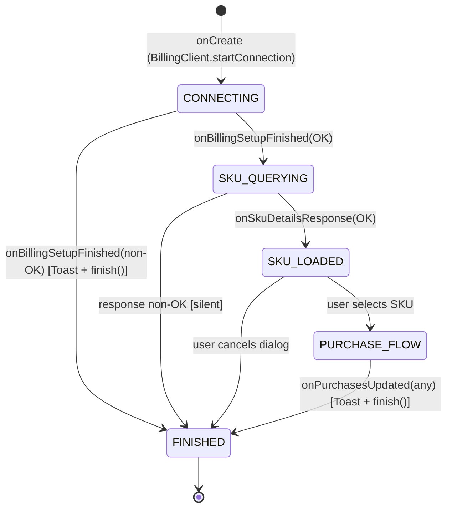

# Screen Specification: DonationActivity

**SCR ID:** SCR-DON-001
**Screen:** DonationActivity — Google Play Billing In-App Purchase Flow
**Source Application:** SMS Backup+
**Complexity:** High
**Priority:** P2 Important
**Last Updated:** 2026-05-29

---

## Section 1: Screen Identity & User Story

**As a** satisfied user of SMS Backup+,
**I want to** make a one-time in-app donation via the Google Play Store,
**So that** I can support the developer of this open-source app financially using a secure payment method.

```gherkin
Feature: DonationActivity — In-App Purchase

  Background:
    Given the user is on the main settings screen
    And has tapped the "Donate" preference item

  Scenario: Billing available — SKU list shown
    Given Google Play Billing is available on this device
    When DonationActivity creates
    Then BillingClient is initialized with pending purchases enabled
    And startConnection() is called
    When onBillingSetupFinished(OK) fires
    Then querySkuDetailsAsync is called for SKUs ["donation.1", "donation.2", "donation.3"]
    When onSkuDetailsResponse returns a list of SkuDetails for donation SKUs
    Then DonationListFragment dialog is shown with sorted SKU list

  Scenario: Debug mode adds test SKUs
    Given the app is a debug build (BuildConfig.DEBUG=true)
    When the SKU list dialog is shown
    Then Sku.Test.SKUS are added to the list before sorting

  Scenario: User selects a donation SKU
    Given the DonationListFragment dialog is visible
    When the user taps a SKU in the list
    Then billingClient.launchBillingFlow() is called with BillingFlowParams for that SkuDetails
    And the Google Play purchase flow overlay appears

  Scenario: Purchase successful — acknowledged
    Given the purchase flow completes
    When onPurchasesUpdated(OK, purchases) fires
    Then for each purchase: acknowledgePurchase() is called if purchaseState==PURCHASED AND NOT acknowledged
    And Toast is shown: "Donation successful, thank you!"
    And activity finishes

  Scenario: Purchase cancelled by user
    When onPurchasesUpdated(USER_CANCELED, ...) fires
    Then Toast is shown: "Donation failed: canceled"
    And activity finishes

  Scenario: SKU unavailable
    When onPurchasesUpdated(ITEM_UNAVAILABLE, ...) fires
    Then Toast is shown: "Donation failed: not available"
    And activity finishes

  Scenario: SKU already owned
    When onPurchasesUpdated(ITEM_ALREADY_OWNED, ...) fires
    Then Toast is shown: "Donation failed: you have already donated"
    And activity finishes

  Scenario: Unspecified billing error
    When onPurchasesUpdated(ERROR or other code, ...) fires
    Then Toast is shown: "Donation failed: unspecified error: {responseCode}"
    And activity finishes

  Scenario: Billing unavailable on device
    Given Google Play Billing is not available
    When onBillingSetupFinished(BILLING_UNAVAILABLE or other non-OK) fires
    Then Toast is shown: "In-app billing is not available"
    And activity finishes

  Scenario: DonationListFragment cancelled
    Given the DonationListFragment dialog is shown
    When user presses back or taps Cancel
    Then onCancel() is called
    And activity finishes

  Scenario: Activity finishing during SKU response
    Given onSkuDetailsResponse fires
    And the activity is finishing() OR stateSaved == true
    Then showSelectDialog() is NOT called (early return guard)
    And no dialog is shown

  Scenario: Activity destroyed — billing client torn down
    When onDestroy() is called
    Then billingClient.endConnection() is called
    And billingClient reference is set to null

  Scenario: Static donation status check from MainSettings
    Given MainSettings.checkUserDonationStatus() calls DonationActivity.checkUserDonationStatus()
    When a new BillingClient is created and connects
    And onBillingSetupFinished(OK) fires
    Then queryPurchases(INAPP) is called synchronously
    When any purchase SKU matches donation.1, donation.2, or donation.3
    Then listener.userDonationState(DONATED) is called
    When no matching purchase exists
    Then listener.userDonationState(NOT_DONATED) is called
    When billing response code is BILLING_UNAVAILABLE
    Then listener.userDonationState(NOT_AVAILABLE) is called
    When billing response code is other non-OK
    Then listener.userDonationState(UNKNOWN) is called
    And endConnection() is always called in finally block
```

---

## Section 2: Screen Layout

DonationActivity has no layout XML of its own — it extends `ThemeActivity` which extends `AppCompatActivity`. The activity is a transparent/themeable container; its only visible UI is:

1. The DonationListFragment AlertDialog (shown immediately after SKUs load)
2. The Google Play billing flow overlay (launched by `launchBillingFlow`)

```
DonationActivity (transparent/themed background)
  |
  +-- [DonationListFragment AlertDialog]
       +---------------------------------------------+
       | "Please specify amount:"                    |
       |--------------------------------------------|
       | [list item] Donation title 1  $1.00         |
       | [list item] Donation title 2  $2.00         |
       | [list item] Donation title 3  $5.00         |
       |--------------------------------------------|
       | [Cancel]                                    |
       +---------------------------------------------+
       
  +-- [Google Play Billing overlay — not owned by app]
```

**Layout semantics:**

| Section | Layout Type | Scroll Behavior |
|---------|-------------|-----------------|
| DonationListFragment | AlertDialog with setItems() list | Scrollable if items overflow |
| Billing flow | Google Play system UI — not customizable | System-managed |

---

## Section 3: Field Inventory

### 3.1 Input Fields

| Field ID | Label | Type | Description |
|----------|-------|------|-------------|
| sku_list_items | (dynamic from Play Store) | List items (AlertDialog.setItems) | Tap to select a donation amount; populated dynamically from SkuDetails |

### 3.2 Display Fields

| Field ID | Label | Data Type | Source | Format | Update Trigger |
|----------|-------|-----------|--------|--------|----------------|
| dialog_title | "Please specify amount:" | string | R.string.ui_dialog_donate_message | Static | Never |
| sku_option | "{SKU title}  {SKU price}" | string | SkuDetails.getTitle() + SkuDetails.getPrice() | "{title}  {price}" (two spaces gap) | Dialog creation |

### 3.3 Validation Rules

No user input to validate. Selection is from a pre-defined list.

### 3.4 State Controllers

```yaml
state_controllers:
  - field_id: billingClient
    trigger: onCreate / onDestroy
    trigger_source: Activity lifecycle
    conditions:
      - when: onCreate
        effects:
          value: new BillingClient created, startConnection() called
      - when: onDestroy
        effects:
          value: endConnection() called; reference set to null
    pseudocode: |
      ON onCreate:
        billingClient = BillingClient.newBuilder(this)
          .setListener(this)
          .enablePendingPurchases()
          .build()
        billingClient.startConnection(stateListener)
      ON onDestroy:
        IF billingClient != null:
          billingClient.endConnection()
          billingClient = null

  - field_id: sku_dialog
    trigger: onSkuDetailsResponse with OK result
    trigger_source: Async callback from querySkuDetailsAsync
    conditions:
      - when: result==OK AND NOT finishing() AND NOT stateSaved
        effects:
          visible: true (DonationListFragment shown)
      - when: result!=OK OR finishing() OR stateSaved
        effects:
          visible: false (early return, no dialog)
    pseudocode: |
      ON onSkuDetailsResponse(result, details):
        IF result.responseCode != OK:
          RETURN
        IF finishing() OR stateSaved:
          RETURN
        filtered = details.filter { it.sku.startsWith("donation.") }
        showSelectDialog(filtered)

  - field_id: stateSaved flag
    trigger: onSaveInstanceState
    trigger_source: System state save (e.g. before rotation)
    conditions:
      - when: onSaveInstanceState called
        effects:
          value: stateSaved = true
      - when: stateSaved == true AND onSkuDetailsResponse fires
        effects:
          value: early return — do not show dialog (prevents "Activity has been destroyed" crash)
    pseudocode: |
      ON onSaveInstanceState:
        stateSaved = true
```

---

## Section 4: Actions & Behaviors

### 4.1 User Actions

| Action ID | Element | Label (exact) | Preconditions | Behavior | Post-Action |
|-----------|---------|--------------|---------------|----------|-------------|
| ACT-DON-001 | List item in DonationListFragment | "{title}  {price}" | billingClient != null | billingClient.launchBillingFlow(BillingFlowParams.setSkuDetails(selected)) | Google Play billing overlay |
| ACT-DON-002 | "Cancel" button in DonationListFragment | "Cancel" | None | onCancel() → activity.finish() | Activity closes |

### 4.2 System Actions

| Action ID | Trigger | Behavior | Frequency |
|-----------|---------|----------|-----------|
| SYS-DON-001 | onCreate | BillingClient.startConnection() | Once per activity creation |
| SYS-DON-002 | onBillingSetupFinished(OK) | queryAvailableSkus() | Once per successful billing setup |
| SYS-DON-003 | onSkuDetailsResponse(OK) | Filter donation SKUs; showSelectDialog() | Once per SKU query response |
| SYS-DON-004 | onPurchasesUpdated(OK) | Acknowledge all PURCHASED+unacknowledged purchases; Toast success; finish() | Each completed purchase |
| SYS-DON-005 | onPurchasesUpdated(non-OK) | Toast failure message; finish() | Each failed/canceled purchase |
| SYS-DON-006 | onBillingServiceDisconnected | Log only; no reconnection logic | On service disconnect |
| SYS-DON-007 | onDestroy | endConnection(); billingClient = null | Once per destroy |

---

## Section 5: State Management

### 5.1 Screen States

| State | Entry Condition | Visual | Exit Condition |
|-------|-----------------|--------|----------------|
| CONNECTING | onCreate | Blank activity (no visible UI yet) | onBillingSetupFinished() |
| SKU_LOADED | onSkuDetailsResponse OK | DonationListFragment AlertDialog shown | User selects SKU or cancels |
| PURCHASE_FLOW | User selects SKU | Google Play system overlay | onPurchasesUpdated() |
| FINISHING | Any terminal event (success/failure/cancel) | Toast shown | Activity.finish() |
| BILLING_UNAVAILABLE | onBillingSetupFinished non-OK | Toast "In-app billing is not available" | Activity.finish() |

### 5.2 Local State Variables

| Variable | Type | Initial Value | Purpose | Persisted |
|----------|------|---------------|---------|-----------|
| billingClient | BillingClient | null | Play Billing client | No |
| stateSaved | boolean | false | Guard against showing dialog after onSaveInstanceState | No (reset on each create) |
| DEBUG_IAB | boolean (static) | BuildConfig.DEBUG | Enables test SKUs and verbose logging | No |

### 5.3 Global State Dependencies

| State Path | Read/Write | Purpose |
|------------|------------|---------|
| Google Play Billing service | Read/Write | SKU queries, purchase flow, acknowledgement |
| BuildConfig.DEBUG | Read | Test SKU injection gate |

---

## Section 6: Business Logic

### 6.1 Business Rules

| Rule ID | Name | Description | Applies To |
|---------|------|-------------|------------|
| BR-DON-001 | Donation SKU filter | Only SKUs with prefix "donation." are shown in the selection list | onSkuDetailsResponse |
| BR-DON-002 | Purchase acknowledgement | Purchases must be acknowledged within 3 days or be refunded; ack is called after every OK purchase | acknowledgePurchase() |
| BR-DON-003 | Activity state guard | Never show dialog if activity is finishing or state has been saved | onSkuDetailsResponse guard |
| BR-DON-004 | SKU sort order | SKUs are sorted before display (Sku implements Comparable — by price value ascending) | showSelectDialog() |
| BR-DON-005 | Debug test SKUs | In debug builds, Sku.Test.SKUS are added to the list for testing without real purchases | showSelectDialog() |
| BR-DON-006 | Static donation check | checkUserDonationStatus() creates a separate BillingClient, queries in-app purchases, checks if any SKU in ALL_SKUS is owned, always calls endConnection() in finally | MainSettings integration |

### 6.2 Calculation Logic

```
// Rule: userHasDonated (BR-DON-006)
FUNCTION userHasDonated(purchases: List<Purchase>): Boolean
  FOR EACH sku IN ["donation.1", "donation.2", "donation.3"]:
    FOR EACH purchase IN purchases:
      IF purchase.getSku() == sku:
        RETURN true
  RETURN false
END FUNCTION

// Rule: acknowledgePurchase (BR-DON-002)
FUNCTION acknowledgePurchase(purchase: Purchase):
  IF purchase.purchaseState == PURCHASED
      AND NOT purchase.isAcknowledged()
      AND billingClient != null:
    params = AcknowledgePurchaseParams(purchaseToken = purchase.purchaseToken)
    billingClient.acknowledgePurchase(params, callback)
END FUNCTION

// Rule: getOptions — DonationListFragment (BR-DON-001, BR-DON-004)
FUNCTION getOptions(skus: List<Sku>): Array<CharSequence>
  options = []
  FOR EACH sku IN skus:
    item = sku.getTitle()
    IF sku.getPrice() is not empty:
      item += "  " + sku.getPrice()
    options.add(item)
  RETURN options.toArray()
END FUNCTION

// Rule: onPurchasesUpdated message selection
FUNCTION getPurchaseMessage(responseCode: Int, purchases: List<Purchase>?): String
  SWITCH responseCode:
    OK:
      RETURN "Donation successful, thank you!"
    ITEM_UNAVAILABLE:
      RETURN "Donation failed: not available"
    ITEM_ALREADY_OWNED:
      RETURN "Donation failed: you have already donated"
    USER_CANCELED:
      RETURN "Donation failed: canceled"
    DEFAULT:
      RETURN "Donation failed: unspecified error: {responseCode}"
END FUNCTION
```

### 6.3 Portability Assessment

| Logic Area | Portability | Notes |
|------------|-------------|-------|
| Purchase message selection | High | Pure switch on response code |
| userHasDonated check | High | Pure collection scan |
| getOptions string building | High | Pure string formatting |
| BillingClient lifecycle | Low | Google Play Billing SDK — Android/Play Store only; iOS equivalent is StoreKit |
| SKU acknowledgement | Low | Play Billing-specific; iOS auto-finishes transactions |
| launchBillingFlow | Low | Play Billing-specific purchase UI |
| stateSaved guard | Medium | Standard Android lifecycle concern; relevant on any platform with UI lifecycle |

---

## Section 7: Data Contracts

### 7.1 API Endpoints (Google Play Billing — internal SDK)

| Interaction | Method | Description | Response |
|-------------|--------|-------------|----------|
| BillingClient.startConnection | SDK async | Establish billing service connection | onBillingSetupFinished(BillingResult) |
| BillingClient.querySkuDetailsAsync | SDK async | Query product details for SKU list | onSkuDetailsResponse(BillingResult, List<SkuDetails>) |
| BillingClient.launchBillingFlow | SDK sync (launches UI) | Start purchase flow | onPurchasesUpdated(BillingResult, List<Purchase>) |
| BillingClient.acknowledgePurchase | SDK async | Acknowledge a completed purchase | onAcknowledgePurchaseResponse(BillingResult) |
| BillingClient.queryPurchases (static check) | SDK sync | Query all in-app purchases | PurchasesResult |

### 7.2 SKU Definitions

| SKU ID | Prefix | Notes |
|--------|--------|-------|
| donation.1 | donation. | Tier 1 donation |
| donation.2 | donation. | Tier 2 donation |
| donation.3 | donation. | Tier 3 donation |

Prices and titles are fetched from Play Store at runtime — not hardcoded. Debug builds inject `Sku.Test.SKUS`.

### 7.3 SkuDetails fields consumed

| Field | Usage |
|-------|-------|
| sku | Filter (startsWith "donation."); match in userHasDonated() |
| getTitle() | Display in list |
| getPrice() | Display in list |
| getOriginalJson() | Passed to new SkuDetails(json) when selected — preserves full Play Billing object |

---

## Section 8: Navigation

### 8.1 Entry Points

| From | Trigger | Notes |
|------|---------|-------|
| MainSettings (root preference screen) | User taps "Donate" preference | Launched via preference Intent (targetClass=DonationActivity) |

### 8.2 Exit Points

| To | Trigger | Notes |
|----|---------|-------|
| Previous screen (MainSettings) | activity.finish() | Called after purchase success, failure, cancel, or billing unavailable |
| Google Play system UI | launchBillingFlow() | Not a navigation — SDK overlay |

### 8.3 Back Stack Behavior

| Scenario | Behavior |
|----------|----------|
| DonationListFragment cancel | activity.finish() — returns to MainSettings |
| Purchase completes | activity.finish() |
| Back pressed on activity | Standard Android back — returns to MainSettings |

---

## Section 9: Conditional Display Logic

### 9.1 Visibility Rules

| Element ID | Condition | When True | When False |
|------------|-----------|-----------|------------|
| DonationListFragment dialog | billingOK AND NOT finishing AND NOT stateSaved | Shown | Not shown; activity finishes with Toast |
| debug SKU items | BuildConfig.DEBUG == true | Test SKUs added to list | Only real SKUs shown |
| sku price in list item | sku.getPrice() is non-empty | "{title}  {price}" shown | Only title shown |
| "Donate" preference in MainSettings | userDonationState == NOT_DONATED | Visible | Removed from preference screen |

### 9.2 Permission Matrix

No permissions required. Google Play Billing uses its own authorization model.

---

## Section 10: Error Handling

### 10.1 Error States

| Error Type | Trigger | User Message (exact) | Recovery |
|------------|---------|----------------------|----------|
| Billing unavailable | onBillingSetupFinished non-OK | "In-app billing is not available" (Toast, LENGTH_LONG) | Activity finishes; user cannot donate |
| Purchase canceled | USER_CANCELED | "Donation failed: canceled" (Toast, LENGTH_LONG) | Activity finishes |
| Item unavailable | ITEM_UNAVAILABLE | "Donation failed: not available" | Activity finishes |
| Already owned | ITEM_ALREADY_OWNED | "Donation failed: you have already donated" | Activity finishes |
| Unspecified error | ERROR/other codes | "Donation failed: unspecified error: {code}" | Activity finishes |
| Activity finishing during SKU response | isFinishing()/stateSaved | No user message; silent early return | N/A |
| Acknowledgement failure | onAcknowledgePurchaseResponse non-OK | Log warning only; no user message | N/A (purchase still counted as complete) |

### 10.2 Error Display Patterns

| Error Type | Display | Style | Duration |
|------------|---------|-------|----------|
| All billing errors | Toast (LENGTH_LONG) | System toast | ~3.5s auto-dismiss |
| Acknowledgement failure | Logcat only | Silent | N/A |

---

## Section 11: Loading States

| State | Trigger | Display | Duration |
|-------|---------|---------|----------|
| Billing connecting | onCreate → startConnection() | Blank activity (no spinner) | Until onBillingSetupFinished |
| SKU query | onBillingSetupFinished(OK) → querySkuDetailsAsync | Blank activity (no spinner) | Until onSkuDetailsResponse |
| Purchase processing | launchBillingFlow | Google Play system UI overlay | Until onPurchasesUpdated |

**Note:** There is no loading spinner or progress indicator while the billing service connects or SKUs are fetched. The activity shows a blank screen. This is a UX deficiency.

---

## Section 12: Accessibility Requirements

**Finding:** No explicit accessibility attributes.

| Element | Required Label | Role |
|---------|---------------|------|
| SKU list items (AlertDialog.setItems) | Accessible via item text string | List items |
| Cancel button | "Cancel" | Button |
| Dialog title | "Please specify amount:" | Heading |

---

## Section 13: Analytics Events

N/A — no analytics.

---

## Section 14: Test Scenarios

### 14.1 Happy Path Tests

```gherkin
Scenario: Successful donation flow end-to-end
  Given Google Play Billing is available
  When DonationActivity starts
  And billing connects (OK)
  And SKU details return 3 donation items
  Then DonationListFragment dialog appears with 3 items
  When user selects item 2
  Then launchBillingFlow is called for that SKU
  When onPurchasesUpdated(OK) fires with one purchase
  Then acknowledgePurchase is called
  And Toast "Donation successful, thank you!" is shown
  And activity finishes

Scenario: Static donation check finds existing purchase
  Given the user has purchased donation.2
  When DonationActivity.checkUserDonationStatus() is called
  Then listener.userDonationState(DONATED) is called
  And the "Donate" preference is removed from MainSettings
```

### 14.2 Validation Tests

```gherkin
Scenario: Billing unavailable causes immediate exit
  Given billing setup returns BILLING_UNAVAILABLE
  When onBillingSetupFinished fires
  Then Toast "In-app billing is not available" is shown
  And activity.finish() is called

Scenario: Purchase canceled by user
  Given the purchase flow was launched
  When user cancels at Google Play
  Then Toast "Donation failed: canceled" is shown
  And activity finishes
```

### 14.3 Edge Cases

| Case | Setup | Action | Expected Result |
|------|-------|--------|-----------------|
| Rotation during SKU load | Activity starts, billing connecting, user rotates device | onSaveInstanceState fires; then onSkuDetailsResponse fires | stateSaved=true; early return in onSkuDetailsResponse; no dialog shown; no crash |
| Already donated — billing check | queryPurchases returns donation.2 purchase | checkUserDonationStatus | userDonationState(DONATED); "Donate" removed from preference screen |
| billingClient null on selectedSku | billingClient was set to null (onDestroy race) | user taps SKU | Early return guard (billingClient == null check); no crash |
| Purchase with purchaseState != PURCHASED | onPurchasesUpdated(OK) with PENDING purchase | acknowledgePurchase | Ack NOT called (purchaseState != PURCHASED guard) |
| Purchase already acknowledged | purchase.isAcknowledged()=true | acknowledgePurchase | Ack NOT called (isAcknowledged() guard) |
| endConnection in finally throws | BillingClient.endConnection() throws | checkUserDonationStatus | Exception caught and ignored (try/catch in finally block) |
| DonationListFragment cancel before billing connects | billingClient != null but SKU dialog cancelled | onCancel | activity.finish() called; onDestroy calls endConnection |
| Zero SKUs after filtering | All returned SKUs lack "donation." prefix | showSelectDialog([]) | Empty dialog shown (no guard against empty list) |

---

## Section 15: Source References

| File | Role |
|------|------|
| `app/src/main/java/com/zegoggles/smssync/activity/donation/DonationActivity.java` | Primary component + static donation check |
| `app/src/main/java/com/zegoggles/smssync/activity/donation/DonationListFragment.java` | SKU selection AlertDialog |
| `app/src/main/java/com/zegoggles/smssync/activity/donation/Sku.java` | SKU data model (wraps SkuDetails) |
| `app/src/main/java/com/zegoggles/smssync/activity/ThemeActivity.java` | Parent activity (theme application) |
| `app/src/main/java/com/zegoggles/smssync/Consts.java` | DONATION_PREFIX, ALL_SKUS constants |
| `app/src/main/res/values/strings.xml` | All user-facing string resources |

---

## Section 16: Feature Flags & Configuration

| Flag/Config | Source | Default | Effect When Enabled | Effect When Disabled |
|-------------|--------|---------|---------------------|---------------------|
| BuildConfig.DEBUG (DEBUG_IAB) | Build configuration | false in release | Test SKUs added to donation list; verbose billing logging | Only real Play Store SKUs shown |

---

## Section 17: Modals, Drawers & Overlays

| Modal ID | Type | Trigger | Dismissal | Content |
|----------|------|---------|-----------|---------|
| MOD-DON-001 DonationListFragment | dialog | onSkuDetailsResponse(OK) | SKU selection or Cancel | AlertDialog with title "Please specify amount:", item list, Cancel button |
| MOD-DON-002 Google Play billing | System overlay (not owned) | launchBillingFlow() | Purchase complete/canceled | Google Play purchase UI |

---

## Section 18: Local Storage & Caching

No local storage. Purchase status is stored in Google Play and queried via `queryPurchases()` at check time.

---

## Section 19: State Machine Diagrams



---

## Section 20: Implementation Notes

### 20.1 Known Complexity Areas
- **Billing 2.x → 7.x migration (Phase 3):** `SkuDetails` → `ProductDetails`; `querySkuDetailsAsync` → `queryProductDetailsAsync`; `BillingFlowParams.setSkuDetails` → `setProductDetailsParamsList`; `queryPurchases()` (sync, deprecated) → `queryPurchasesAsync()`. This is the primary migration task for this screen.
- **stateSaved flag pattern:** The `stateSaved` flag is a workaround for the async callback arriving after `onSaveInstanceState`. This is a known Android pattern; Billing 7.x improves this with better lifecycle awareness.
- **No loading indicator:** Blank screen while billing service connects. If the Play Store is slow, users see nothing for several seconds.
- **Empty SKU list edge case:** If all SKUs are filtered out or the Play Store returns an empty list, an empty dialog is shown with no guard.

### 20.2 Recommended Approach (Billing 7.x migration)
The migration is isolated to three files (`DonationActivity.java`, `DonationListFragment.java`, `Sku.java`) and has no ripple effects into the rest of the codebase. Recommended:
1. Replace `SkuDetails` with `ProductDetails` throughout.
2. Replace `querySkuDetailsAsync` with `queryProductDetailsAsync`.
3. Replace `BillingFlowParams.Builder.setSkuDetails()` with `setProductDetailsParamsList()`.
4. Replace synchronous `queryPurchases()` in `checkUserDonationStatus()` with `queryPurchasesAsync()` + coroutine.
5. Add a loading progress indicator while billing connects.

### 20.3 Dependencies
- Google Play Billing library (`com.android.billingclient:billing:2.1.0` → target `7.x`)
- `Consts.Billing.ALL_SKUS` — SKU identifiers
- `MainSettings.checkUserDonationStatus()` — calls the static method on this class

### 20.4 Technical Debt
- No loading indicator while connecting to Play Billing
- Empty SKU list not guarded — would show empty dialog
- `queryPurchases()` is synchronous and deprecated in Billing 3.0+
- `Sku.getOriginalJson()` → `new SkuDetails(json)` roundtrip needed because DonationListFragment works with `Sku` objects but needs `SkuDetails` to pass back to `launchBillingFlow`; Billing 7.x uses `ProductDetails` which is not serializable

### 20.5 Migration Considerations
- The `DonationStatusListener.State` enum (DONATED, NOT_DONATED, UNKNOWN, NOT_AVAILABLE) is a clean abstraction that survives the Billing SDK migration unchanged
- `checkUserDonationStatus()` is called from `MainSettings.onResume()` — its async behavior must not block the main thread after the Billing 7.x migration (currently synchronous via `queryPurchases()`)
- If migrating to Billing 7.x: `queryPurchasesAsync` returns in the billing library's callback thread — UI updates must be marshalled back to main thread

---

## Screen Metrics

| Metric | Count |
|--------|-------|
| Input Fields | 1 (SKU list selection) |
| Display Fields | 2 (dialog title, SKU list items) |
| Actions (User) | 2 (select SKU, cancel) |
| Actions (System) | 7 |
| Screen States | 5 |
| State Controllers | 3 |
| Validation Rules | 0 |
| API Endpoints | 5 (Billing SDK operations) |
| Business Rules | 6 |
| Visibility Rules | 4 |
| Error Types | 6 |
| Loading States | 3 |
| Analytics Events | 0 |
| Test Scenarios | 8 |
| Modals/Drawers | 2 |

---

<!-- SELF-CHECK
Date: 2026-05-29
Checklist: 57/66
Gaps Found:
- Analytics: none; documented N/A
- Deep links: not applicable (internal navigation only)
- Accessibility: no source attributes; documented requirements
- Loading spinner: absent in source; documented as UX deficiency
Result: READY FOR AUDIT
-->
