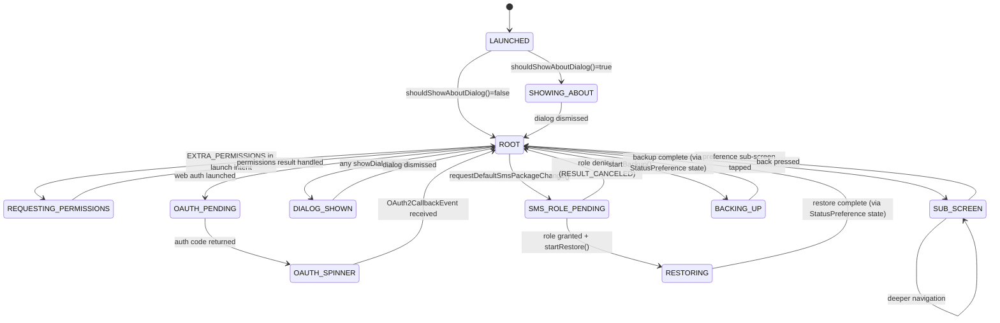

# Screen Specification: MainActivity

**SCR ID:** SCR-MAIN-001
**Screen:** MainActivity — Settings Host + Auth/Backup/Restore Controller
**Source Application:** SMS Backup+
**Complexity:** High
**Priority:** P1 Critical
**Last Updated:** 2026-05-29

---

## Section 1: Screen Identity & User Story

**As a** device owner who wants to back up or restore SMS/MMS/call log data,
**I want to** see the current backup status, trigger manual backups and restores, and configure the application,
**So that** my messages are safely archived to my IMAP mailbox and can be recovered to the device.

**As a** first-time user,
**I want to** be guided through connecting a Google or IMAP account and granting the required permissions,
**So that** the app is ready to perform its first backup.

```gherkin
Feature: MainActivity — Settings Host and Backup Controller

  Background:
    Given the SMS Backup+ application is installed
    And I am on the main settings screen

  Scenario: First launch — about dialog appears
    Given the app version code is higher than the last seen version code in preferences
    When the activity starts
    Then the "About" dialog is displayed automatically
    And after dismissing it the main settings screen is shown

  Scenario: Initiating a manual backup with credentials set
    Given login credentials are configured
    And "Confirm actions" preference is false
    And this is NOT the first backup (sync date exists for at least one data type)
    When the user taps the "Backup" button on the StatusPreference widget
    Then a PerformAction(Backup, confirm=false) event is posted to the Otto bus
    And the SmsBackupService is started with action "MANUAL"

  Scenario: First backup — prompts skip-or-backup dialog
    Given login credentials are configured
    And "Confirm actions" preference is false
    And this IS the first backup (no max-synced-date exists for any data type)
    When the user taps "Backup"
    Then the "First backup" dialog appears
    And shows either unbatched or batched message depending on max_items_per_sync
    When the user taps "Backup" in the dialog
    Then Backup action is posted
    When the user taps "Skip" in the dialog
    Then BackupSkip action is posted

  Scenario: Backup with confirm-action enabled
    Given login credentials are configured
    And "Confirm actions" preference is true
    When the user taps "Backup"
    Then the "Confirm Action" dialog appears with title "Confirm Action" and message "Are you sure want to perform the action?"
    When the user taps "OK"
    Then Backup action proceeds

  Scenario: Backup without credentials set
    Given no login credentials are configured (neither OAuth2 tokens nor IMAP username/password)
    When the user taps "Backup"
    Then the "Missing Credentials" dialog is shown with message "You need to set your username and password first."

  Scenario: Restore initiated on Android >= KitKat when app is NOT default SMS app
    Given the device runs Android >= 4.4 (KitKat)
    And SMS Backup+ is NOT the default SMS app
    And a default SMS package is recorded in preferences
    And the user has NOT seen the SMS default-package dialog before
    When the user taps "Restore"
    Then the "SMS Default Package Change" dialog is shown explaining the temporary default-app change

  Scenario: Restore initiated on Android >= KitKat, already seen dialog
    Given the device runs Android >= 4.4
    And a default SMS package is recorded
    And the user HAS already seen the dialog
    When the user taps "Restore"
    Then requestDefaultSmsPackageChange() is called immediately
    And on Android Q+ the RoleManager SMS role request intent is fired
    And on Android < Q the ACTION_CHANGE_DEFAULT intent is fired

  Scenario: OAuth2 web authentication flow
    Given the user navigates to Advanced > Legacy > Connect
    And the AccountConnectionChangedEvent(connected=true) is posted
    When AccountManagerAuthActivity returns RESULT_OK with ACTION_ADD_ACCOUNT
    Then the account token is stored and AccountAddedEvent is posted
    When AccountManagerAuthActivity returns RESULT_OK with ACTION_FALLBACK_AUTH
    Then the WEB_CONNECT dialog is shown explaining browser login
    When the user confirms the WEB_CONNECT dialog
    Then OAuth2WebAuthActivity is launched for result
    When OAuth2WebAuthActivity returns a non-empty auth code
    Then the OAUTH2_ACCESS_TOKEN_PROGRESS spinner dialog is shown
    And OAuth2CallbackTask executes with the code
    When the callback succeeds
    Then credentials are stored and AccountAddedEvent is posted
    When the callback fails
    Then the OAUTH2_ACCESS_TOKEN_ERROR dialog is shown

  Scenario: OAuth2 web auth returns cancelled
    Given the web auth activity was launched
    When it returns RESULT_CANCELED
    Then a Toast is shown: "Could not obtain access token. Make sure you select \"Allow\"."

  Scenario: Missing permissions detected during backup
    Given a manual backup starts
    And the service discovers a missing Android permission
    And backupStateChanged fires with a permission exception and backupType=MANUAL
    When onRequestPermissionsResult returns all granted
    Then the backup is restarted (SmsBackupService started with MANUAL)
    When not all granted
    Then MissingPermissionsEvent is posted listing denied permissions

  Scenario: Theme changed
    Given the user toggles "Dark theme" in Advanced settings
    When ThemeChangedEvent is received
    Then recreate() is called on the activity, restarting it with the new theme

  Scenario: Navigation — back stack
    Given the user has navigated into a nested preference sub-screen (e.g., Backup Settings)
    Then the ActionBar shows "up" arrow
    And the ActionBar subtitle shows the nested screen title
    When the user presses up or back
    Then the back-stack entry is popped and ActionBar updates accordingly

  Scenario: Restore completes while app is default SMS app
    Given a restore operation was running and SMS Backup+ is the default SMS app
    When restoreStateChanged fires with isFinished()=true
    Then restoreDefaultSmsProvider is called with the stored original SMS package

  Scenario: Startup permission request from intent extra
    Given the activity was started with EXTRA_PERMISSIONS in the Intent
    When the activity starts
    Then ActivityCompat.requestPermissions is called for the listed permissions with REQUEST_PERMISSIONS_BACKUP_SERVICE
    When all granted
    Then SmsBackupService is started with MANUAL
    When not all granted
    Then MissingPermissionsEvent is posted

  Scenario: App is unexpectedly the default SMS app on startup (e.g. after crash)
    Given on creation, isSmsBackupDefaultSmsApp() returns true
    And SmsRestoreService is idle
    When the activity creates
    Then restoreDefaultSmsProvider is called immediately to release the SMS role
```

---

## Section 2: Screen Layout

### Primary Screen State (MainActivity host)

```
+---------------------------------------------+
| TOOLBAR                                     |
| [App Icon] SMS Backup+   [About][Reset][Log]|
+---------------------------------------------+
| FRAGMENT CONTAINER (preferences_container)  |
|                                             |
|  [StatusPreference widget — see SCR-SP-001] |
|  +-----------------------------------------+|
|  | IMAP settings               [arrow >]   ||
|  | Backup settings             [arrow >]   ||
|  | [x] Auto backup             summary txt ||
|  | Auto backup settings        [arrow >]   ||
|  | Advanced settings           [arrow >]   ||
|  | Donate                                  ||
|  +-----------------------------------------+|
+---------------------------------------------+
```

### Nested sub-screen state (back-stack entry exists)

```
+---------------------------------------------+
| TOOLBAR                                     |
| [<-]  Sub-screen title (breadcrumb subtitle)|
+---------------------------------------------+
| FRAGMENT CONTAINER                          |
|  [Nested preference fragment content]       |
+---------------------------------------------+
```

**Layout semantics:**

| Section | Layout Type | Scroll Behavior | Notes |
|---------|-------------|-----------------|-------|
| Toolbar | LinearLayout header | Fixed (sticky) | Implemented with AppCompatWidget Toolbar |
| Fragment container | FrameLayout | Fragment controls scrolling | R.id.preferences_container |
| Preference list | RecyclerView (via PreferenceFragmentCompat) | Scrollable | Content managed by AndroidX Preference |

**Component placement (main.xml root → top to bottom):**

| Order | Component ID | Section | Width | Alignment |
|-------|--------------|---------|-------|-----------|
| 1 | @id/toolbar | Header | match_parent | Top |
| 2 | @id/preferences_container | Body | match_parent | Below toolbar |

---

## Section 3: Field Inventory

### 3.1 Input Fields

This screen has no direct input fields. All inputs are hosted in preference fragment sub-screens (see SCR-ADV-001 and SCR-MAIN-001 fragments). The StatusPreference widget hosts buttons documented in SCR-SP-001.

### 3.2 Display Fields

| Field ID | Label | Data Type | Source | Format | Update Trigger |
|----------|-------|-----------|--------|--------|----------------|
| toolbar_title | "SMS Backup+" | string | app_name resource | Static | Never |
| toolbar_subtitle | Sub-screen name | string | Back-stack breadcrumb title | string (res ID resolved to text) | onBackStackChanged() |
| actionbar_up_indicator | [Up arrow] | boolean | Fragment back-stack count | Visible when backStackEntryCount > 0 | onBackStackChanged() |

### 3.3 Validation Rules

No direct field validation on this screen. IMAP folder validation is delegated to AdvancedSettings (SCR-ADV-001). Credential completeness is checked via `AuthPreferences.isLoginInformationSet()` before initiating backup/restore.

### 3.4 State Controllers

```yaml
state_controllers:
  - field_id: toolbar_up_indicator
    trigger: Back-stack entry added or removed
    trigger_source: onBackStackChanged() callback from FragmentManager
    conditions:
      - when: getSupportFragmentManager().getBackStackEntryCount() > 0
        effects:
          visible: true
          enabled: true
      - when: getSupportFragmentManager().getBackStackEntryCount() == 0
        effects:
          visible: false
    pseudocode: |
      ON backStackChanged:
        entryCount = fragmentManager.getBackStackEntryCount()
        actionBar.setDisplayHomeAsUpEnabled(entryCount > 0)
        actionBar.setSubtitle(entryCount > 0 ? getTopEntry().getBreadCrumbTitleRes() : 0)

  - field_id: backup_action_routing
    trigger: PerformAction Otto event received
    trigger_source: Otto bus subscription on StatusPreference button click or ConfirmAction dialog confirm
    conditions:
      - when: authPreferences.isLoginInformationSet() == false
        effects:
          visible: true  # MISSING_CREDENTIALS dialog shown
      - when: action.confirm == true
        effects:
          visible: true  # CONFIRM_ACTION dialog shown
      - when: action.action == Backup AND preferences.isFirstBackup() == true AND action.confirm == false
        effects:
          visible: true  # FIRST_SYNC dialog shown
      - when: credentials set AND not confirm AND not first backup
        effects:
          enabled: true  # doPerform(action.action) called directly
    pseudocode: |
      ON performAction(action):
        IF NOT authPreferences.isLoginInformationSet():
          showDialog(MISSING_CREDENTIALS)
          RETURN
        IF action.confirm:
          showDialog(CONFIRM_ACTION, bundleWith(action.action.name()))
          RETURN
        IF action.action == Backup AND preferences.isFirstBackup():
          showDialog(FIRST_SYNC)
          RETURN
        doPerform(action.action)

  - field_id: restore_flow_controller
    trigger: Restore action dispatched
    trigger_source: doPerform(Restore) or backupStateChanged completing restore
    conditions:
      - when: Android API < KitKat (19)
        effects:
          value: start SmsRestoreService directly
      - when: API >= KitKat AND isSmsBackupDefaultSmsApp()
        effects:
          value: start SmsRestoreService directly
      - when: API >= KitKat AND NOT default app AND defaultSmsPackage is non-empty AND hasSeenDialog
        effects:
          value: call requestDefaultSmsPackageChange()
      - when: API >= KitKat AND NOT default app AND defaultSmsPackage is non-empty AND NOT hasSeenDialog
        effects:
          value: show SMS_DEFAULT_PACKAGE_CHANGE dialog
      - when: API >= KitKat AND NOT default app AND defaultSmsPackage is empty
        effects:
          value: show Toast "No default SMS package set."
    pseudocode: |
      FUNCTION startRestore():
        IF Build.VERSION < KITKAT:
          startService(SmsRestoreService)
          RETURN
        IF isSmsBackupDefaultSmsApp():
          startService(SmsRestoreService)
          RETURN
        defaultPkg = Sms.getDefaultSmsPackage()
        IF defaultPkg is empty:
          Toast("No default SMS package set.")
          RETURN
        preferences.setSmsDefaultPackage(defaultPkg)
        IF preferences.hasSeenSmsDefaultPackageChangeDialog():
          requestDefaultSmsPackageChange()
        ELSE:
          showDialog(SMS_DEFAULT_PACKAGE_CHANGE)

  - field_id: sms_role_request_routing
    trigger: requestDefaultSmsPackageChange() called (after dialog confirmation or direct call)
    trigger_source: SMS_DEFAULT_PACKAGE_CHANGE dialog OK / hasSeenDialog path
    conditions:
      - when: Android API >= Q (29) AND RoleManager != null AND NOT roleSmsHeld
        effects:
          value: SmsReceiver.enable(); launch RoleManager.createRequestRoleIntent(ROLE_SMS)
      - when: Android API < Q
        effects:
          value: send ACTION_CHANGE_DEFAULT intent with package name
    pseudocode: |
      FUNCTION requestDefaultSmsPackageChange():
        IF Build.VERSION >= Q:
          roleManager = getSystemService(ROLE_SERVICE)
          IF roleManager != null AND NOT roleManager.isRoleHeld(ROLE_SMS):
            SmsReceiver.enable(context)
            startActivityForResult(roleManager.createRequestRoleIntent(ROLE_SMS), REQUEST_CHANGE_DEFAULT_SMS_PACKAGE)
        ELSE:
          intent = Intent(ACTION_CHANGE_DEFAULT).putExtra(EXTRA_PACKAGE_NAME, packageName)
          startActivityForResult(intent, REQUEST_CHANGE_DEFAULT_SMS_PACKAGE)

  - field_id: restore_default_sms_provider
    trigger: Restore finishes OR startup detects app is unexpectedly default SMS app
    trigger_source: restoreStateChanged(finished) OR onCreate checkDefaultSmsApp()
    conditions:
      - when: Android >= Q
        effects:
          value: SmsReceiver.disable(context)  [kills app if permission revoked]
      - when: Android < Q AND smsPackage non-empty
        effects:
          value: send ACTION_CHANGE_DEFAULT intent with stored original package
    pseudocode: |
      FUNCTION restoreDefaultSmsProvider(smsPackage: String):
        IF Build.VERSION >= Q:
          SmsReceiver.disable(context)
          RETURN
        IF smsPackage is not empty:
          startActivity(Intent(ACTION_CHANGE_DEFAULT).putExtra(EXTRA_PACKAGE_NAME, smsPackage))
```

---

## Section 4: Actions & Behaviors

### 4.1 User Actions

| Action ID | Element | Label (exact) | Preconditions | Behavior | Post-Action |
|-----------|---------|--------------|---------------|----------|-------------|
| ACT-M-001 | Menu item | "About" | None | showDialog(ABOUT) | About dialog appears |
| ACT-M-002 | Menu item | "Reset" | None | showDialog(RESET) | Reset dialog appears |
| ACT-M-003 | Menu item | "View log" | None | showDialog(VIEW_LOG) | Log dialog appears |
| ACT-M-004 | ActionBar up button | [up arrow] | backStackEntryCount > 0 | onBackPressed() | Fragment popped |
| ACT-M-005 | Preference item "IMAP settings" | "IMAP settings" | None | onPreferenceStartFragment → show AdvancedSettings.Server fragment | Navigates into Server screen |
| ACT-M-006 | Preference item "Backup settings" | "Backup settings" | None | show AdvancedSettings.Backup fragment | Navigates into Backup screen |
| ACT-M-007 | Preference item "Auto backup settings" | "Auto backup settings" | enable_auto_sync == true AND credentials set | show AutoBackupSettings fragment | Navigates into schedule screen |
| ACT-M-008 | Preference item "Advanced settings" | "Advanced settings" | None | show AdvancedSettings.Main fragment | Navigates into Advanced screen |
| ACT-M-009 | Preference item "Donate" | "Donate" | None | Launch DonationActivity via intent | Navigates to donation flow |
| ACT-M-010 | WEB_CONNECT dialog OK | "OK" | None | startActivityForResult(OAuth2WebAuthActivity, REQUEST_WEB_AUTH) | Web auth launched |
| ACT-M-011 | First sync dialog "Backup" | "Backup" | None | App.post(Backup action) | Backup starts |
| ACT-M-012 | First sync dialog "Skip" | "Skip" | None | App.post(BackupSkip action) | BackupSkip starts |
| ACT-M-013 | Confirm dialog "OK" | "OK" | None | App.post(PerformAction(action, false)) | Action executes |
| ACT-M-014 | SMS default package dialog "OK" | "OK" | MainActivity cast succeeds | requestDefaultSmsPackageChange() | Role request launched |
| ACT-M-015 | Disconnect dialog "OK" | "OK" | None | App.post(AccountRemovedEvent) | Account data cleared |
| ACT-M-016 | Reset dialog "OK" | "OK" | None | App.post(SettingsResetEvent) | Sync state reset |
| ACT-M-017 | AccountManagerTokenError dialog "Yes" | Android "yes" | None | App.post(FallbackAuthEvent(false)) → launches web auth directly | Web auth launched |

**Confirmation dialogs — exact text:**

| Dialog ID | Title | Message | Confirm Button | Cancel Button |
|-----------|-------|---------|----------------|---------------|
| FIRST_SYNC (unbatched) | "First backup" | "Backup or skip all messages currently stored on this device?" | "Backup" | "Skip" |
| FIRST_SYNC (batched, N items) | "First backup" | "Backup or skip all messages currently stored on this device?\n\nNote: The backup will be split into batches of N messages." | "Backup" | "Skip" |
| CONFIRM_ACTION | "Confirm Action" | "Are you sure want to perform the action?" | "OK" | "Cancel" |
| MISSING_CREDENTIALS | "Login information" | "You need to set your username and password first." | "OK" | — |
| WEB_CONNECT | (no title) | "A browser window will open, prompting you to log into Gmail to grant SMS Backup+ access to your emails." | "OK" | "Cancel" |
| DISCONNECT | "Confirm Action" | "Are you sure? You will need to reauthorize your account after disconnecting and the local sync state will be reset." | "OK" | "Cancel" |
| RESET | "Reset current sync state" | "Do you want to reset the current sync state? You can still choose to skip all messages later." | "OK" | "Cancel" |
| SMS_DEFAULT_PACKAGE_CHANGE | "Required app change" | [long multi-line message about temporary SMS app change — see strings.xml] | "OK" | — |
| OAUTH2_ACCESS_TOKEN_ERROR | "Authorisation failure" | "Could not obtain access token. Make sure you select \"Allow\"." | "OK" | — |
| ACCOUNT_MANAGER_TOKEN_ERROR | "Error" | "Could not get token from system. Do you want to try the browser authentication method?" | "Yes" | "No" |
| ABOUT | "SMS Backup+ {version}" | WebView loading file:///android_asset/about.html | "OK" | — |
| VIEW_LOG | (from AppLog.displayAsDialog) | Log content | "OK" | — |

### 4.2 System Actions

| Action ID | Trigger | Behavior | Frequency |
|-----------|---------|----------|-----------|
| SYS-M-001 | onCreate (first install / version upgrade) | Show About dialog if shouldShowAboutDialog() | Once per version upgrade |
| SYS-M-002 | onCreate | checkDefaultSmsApp() — release SMS role if held unexpectedly | Every launch |
| SYS-M-003 | onCreate | requestPermissionsIfNeeded() — checks EXTRA_PERMISSIONS in launch intent | Every launch |
| SYS-M-004 | onStart | App.register(this) — subscribe to Otto bus | Each start |
| SYS-M-005 | onStop | App.unregister(this) — unsubscribe from Otto bus | Each stop |
| SYS-M-006 | onActivityResult REQUEST_CHANGE_DEFAULT_SMS_PACKAGE (not canceled) | preferences.setSeenSmsDefaultPackageChangeDialog(); if package set → startRestore() | After role/default-package result |
| SYS-M-007 | backupStateChanged — permission exception AND manual backup | ActivityCompat.requestPermissions for missing permissions | On each permission-gate state |
| SYS-M-008 | ThemeChangedEvent received | recreate() — full activity restart | On theme toggle |
| SYS-M-009 | onRestoreInstanceState | onBackStackChanged() to sync ActionBar state | On configuration change restore |

---

## Section 5: State Management

### 5.1 Screen States

| State | Entry Condition | Visual | Exit Condition |
|-------|-----------------|--------|----------------|
| IDLE / ROOT | No active back-stack | Root preference list, no subtitle, no up arrow | User taps a sub-screen preference |
| SUB_SCREEN | Back-stack entry pushed | Sub-screen fragment, subtitle = screen title, up arrow shown | Back pressed or onSupportNavigateUp |
| DIALOG_SHOWN | showDialog() called | Appropriate dialog overlaid on top of current fragment | Dialog dismissed |
| PERMISSION_REQUESTING | ActivityCompat.requestPermissions called | System permission dialog overlay | User responds to permission dialog |
| OAUTH_CALLBACK_PENDING | OAuth2CallbackTask.execute() launched | OAUTH2_ACCESS_TOKEN_PROGRESS spinner shown | OAuth2CallbackEvent received |
| SMS_ROLE_PENDING | startActivityForResult for SMS role launched | System role/default-SMS dialog | onActivityResult(REQUEST_CHANGE_DEFAULT_SMS_PACKAGE) |

### 5.2 Local State Variables

| Variable | Type | Initial Value | Purpose | Persisted |
|----------|------|---------------|---------|-----------|
| preferences | Preferences | new Preferences(this) in onCreate | Typed preferences facade | No (in-memory; reads SharedPreferences) |
| authPreferences | AuthPreferences | new AuthPreferences(this) in onCreate | Typed auth preferences facade | No |
| oauth2Client | OAuth2Client | new OAuth2Client(clientId) in onCreate | Builds OAuth2 auth URL and handles token exchange | No |
| fallbackAuthIntent | Intent | new Intent(OAuth2WebAuthActivity) with requestUrl() | Pre-built intent for web auth fallback | No |
| preferenceTitles | PreferenceTitles | new PreferenceTitles(resources, R.xml.preferences) | Maps preference keys to title resource IDs for ActionBar breadcrumbs | No |

### 5.3 Global State Dependencies

| State Path | Read/Write | Purpose |
|------------|------------|---------|
| SharedPreferences (default) | Read | All user preferences via Preferences facade |
| SharedPreferences "credentials" | Read/Write | OAuth2 tokens, IMAP password via AuthPreferences |
| App.bus (Otto) | Read/Write | Subscribe to BackupState, RestoreState, OAuth2CallbackEvent, AccountConnectionChangedEvent, FallbackAuthEvent, ThemeChangedEvent, PerformAction; post AccountAddedEvent, MissingPermissionsEvent |
| SmsBackupService static isServiceWorking() | Read | Used by StatusPreference to label backup button |
| SmsRestoreService static isServiceIdle() | Read | Used by StatusPreference to label restore button |

---

## Section 6: Business Logic

### 6.1 Business Rules

| Rule ID | Name | Description | Applies To |
|---------|------|-------------|------------|
| BR-M-001 | Credential gate | Backup/restore may not be initiated without complete login credentials | performAction() |
| BR-M-002 | First-backup dialog | On first ever backup, user must choose to backup or skip existing messages | performAction() → FIRST_SYNC |
| BR-M-003 | Confirm-action gate | If "Confirm actions" is enabled, every user-initiated action requires a confirmation dialog | performAction() → CONFIRM_ACTION |
| BR-M-004 | SMS default-app role | Restore on Android >= KitKat requires the app to temporarily become the default SMS app | startRestore() |
| BR-M-005 | About on version upgrade | Show About dialog once per app version upgrade | onCreate → shouldShowAboutDialog() |
| BR-M-006 | Version-upgrade About | shouldShowAboutDialog() returns true when currentVersionCode > lastSeenVersionCode; side-effects: stores currentVersionCode | Preferences.shouldShowAboutDialog() |
| BR-M-007 | OAuth2 fallback chain | If AccountManager token fails, user can opt into web-based OAuth2 fallback | AccountManagerTokenError dialog |
| BR-M-008 | Permission retry | After granting permissions, the same backup type that was attempted is retried | onRequestPermissionsResult() |

### 6.2 Calculation Logic

```
// Rule: shouldShowAboutDialog (BR-M-005, BR-M-006)
FUNCTION shouldShowAboutDialog(context: Context, preferences: SharedPreferences): Boolean
  currentVersionCode: Int = App.getVersionCode(context)
  lastSeenCode: Int = preferences.getInt("last_version_code", 0)
  IF lastSeenCode < currentVersionCode:
    preferences.edit().putInt("last_version_code", currentVersionCode).commit()
    RETURN true
  RETURN false
END FUNCTION

// Rule: isFirstBackup (BR-M-002)
FUNCTION isFirstBackup(preferences: SharedPreferences, dataTypes: List<DataType>): Boolean
  FOR EACH type IN dataTypes:
    IF preferences.contains(type.maxSyncedPreference):
      RETURN false
  RETURN true
END FUNCTION

// Rule: isLoginInformationSet (BR-M-001)
FUNCTION isLoginInformationSet(authPrefs: AuthPreferences): Boolean
  IF authMode == PLAIN:
    RETURN NOT empty(imapPassword) AND NOT empty(imapUsername) AND NOT empty(serverAddress)
  IF authMode == XOAUTH:
    RETURN hasOAuth2Tokens()  // username non-null AND token non-null
  RETURN false
END FUNCTION

// Rule: requestDefaultSmsPackageChange (BR-M-004)
FUNCTION requestDefaultSmsPackageChange():
  IF sdkInt >= Q:
    roleManager = getSystemService(ROLE_SERVICE)
    IF roleManager != null AND NOT roleManager.isRoleHeld(ROLE_SMS):
      SmsReceiver.enable(context)
      startActivityForResult(roleManager.createRequestRoleIntent(ROLE_SMS), REQUEST_CHANGE_DEFAULT_SMS_PACKAGE)
  ELSE:
    startActivityForResult(
      Intent(ACTION_CHANGE_DEFAULT, EXTRA_PACKAGE_NAME=packageName),
      REQUEST_CHANGE_DEFAULT_SMS_PACKAGE)
END FUNCTION
```

### 6.3 Portability Assessment

| Logic Area | Portability | Notes |
|------------|-------------|-------|
| Credential completeness check | High | Pure boolean logic on stored strings |
| First-backup detection | High | Checks presence of keys in SharedPreferences |
| shouldShowAboutDialog | High | Pure version comparison with persistent storage |
| SMS default-app role request | Low | Android-specific: RoleManager (API 29+) or ACTION_CHANGE_DEFAULT intent (pre-29). No direct equivalent on iOS. |
| Otto event subscription pattern | Low | Framework-specific; target platform needs a reactive stream or callback pattern |
| Fragment back-stack breadcrumb | Medium | Standard navigation stack concept; implementation differs per platform |
| Permission request flow | Low | Android runtime permission model; iOS equivalent is AVAuthorizationStatus/PHAuthorizationStatus |

---

## Section 7: Data Contracts

### 7.1 API Endpoints

This screen does not call external API endpoints directly. It orchestrates:
- Local Android service starts (`Intent` to `SmsBackupService` / `SmsRestoreService`)
- Local `AccountManagerAuthActivity` via `startActivityForResult`
- Local `OAuth2WebAuthActivity` via `startActivityForResult`
- `OAuth2CallbackTask` (async) which calls `OAuth2Client.accessToken()` → `https://accounts.google.com/o/oauth2/token`

The external OAuth2 token exchange is documented in the non-visual spec for `OAuth2Client`. From this screen's perspective:

| Interaction | Type | Request | Response |
|-------------|------|---------|----------|
| AccountManagerAuthActivity | Activity result (REQUEST_PICK_ACCOUNT) | — | Intent with EXTRA_TOKEN, EXTRA_ACCOUNT, or EXTRA_ERROR |
| OAuth2WebAuthActivity | Activity result (REQUEST_WEB_AUTH) | — | Intent with EXTRA_CODE (auth code string) |
| SMS role request | Activity result (REQUEST_CHANGE_DEFAULT_SMS_PACKAGE) | — | RESULT_OK or RESULT_CANCELED |
| OAuth2CallbackTask | Otto event | auth_code: String | OAuth2CallbackEvent { token: OAuth2Token, valid(): Boolean } |

### 7.2 Intent Extras Consumed (onActivityResult)

**REQUEST_PICK_ACCOUNT (from AccountManagerAuthActivity):**
- `ACTION_ADD_ACCOUNT` action: `EXTRA_TOKEN` (String), `EXTRA_ACCOUNT` (String)
- `ACTION_FALLBACK_AUTH` action: no extras; triggers FallbackAuthEvent(true)
- Error path: `EXTRA_ERROR` (String, non-empty)

**REQUEST_WEB_AUTH (from OAuth2WebAuthActivity):**
- RESULT_CANCELED: show Toast (access token error message)
- RESULT_OK: `EXTRA_CODE` (String) — the OAuth2 authorization code

**REQUEST_CHANGE_DEFAULT_SMS_PACKAGE:**
- RESULT_CANCELED: no action
- Anything else: `preferences.setSeenSmsDefaultPackageChangeDialog()`; if `getSmsDefaultPackage() != null` then `startRestore()`

### 7.3 Intent Extras Consumed on Launch

| Key | Type | Purpose |
|-----|------|---------|
| EXTRA_PERMISSIONS ("permissions") | String[] | List of Android permission strings to request on startup |

### 7.4 Entity References

| Entity | Fields Used | Reference |
|--------|-------------|-----------|
| AuthPreferences | isLoginInformationSet(), setOauth2Token(), getOAuth2ClientId(), getOauth2Username() | app/src/main/java/com/zegoggles/smssync/preferences/AuthPreferences.java |
| Preferences | isFirstBackup(), getMaxItemsPerSync(), confirmAction(), shouldShowAboutDialog(), getSmsDefaultPackage(), hasSeenSmsDefaultPackageChangeDialog(), setSeenSmsDefaultPackageChangeDialog(), setSmsDefaultPackage() | app/src/main/java/com/zegoggles/smssync/preferences/Preferences.java |
| OAuth2Client | requestUrl() | app/src/main/java/com/zegoggles/smssync/auth/OAuth2Client.java |
| BackupState | isPermissionException(), getMissingPermissions(), backupType | app/src/main/java/com/zegoggles/smssync/service/state/BackupState.java |
| RestoreState | isFinished() | app/src/main/java/com/zegoggles/smssync/service/state/RestoreState.java |

---

## Section 8: Navigation

### 8.1 Entry Points

| From | Trigger | Route Params | Deep Link |
|------|---------|--------------|-----------|
| Android Launcher | User taps app icon | None | None |
| SmsBackupService (via Intent) | Missing permission during background backup | EXTRA_PERMISSIONS: String[] — list of missing permissions | None |
| Any receiver (implicit) | System launches LAUNCHER activity | None | None |

### 8.2 Exit Points

| To Screen | Trigger | Params Passed | Back Behavior |
|-----------|---------|---------------|---------------|
| AccountManagerAuthActivity | AccountConnectionChangedEvent(connected=true) | None | Returns to MainActivity via onActivityResult |
| OAuth2WebAuthActivity | WEB_CONNECT dialog OK or AccountManagerTokenError "Yes" | Intent data = oauth2Client.requestUrl() | Returns to MainActivity via onActivityResult |
| DonationActivity | User taps "Donate" preference | None (started via preference intent) | Android back |
| AdvancedSettings.Server | User taps "IMAP settings" | Fragment argument: rootKey, SCREEN_TITLE_RES | Fragment back-stack pop |
| AdvancedSettings.Backup | User taps "Backup settings" | Fragment argument: rootKey, SCREEN_TITLE_RES | Fragment back-stack pop |
| AutoBackupSettings | User taps "Auto backup settings" | Fragment argument: rootKey, SCREEN_TITLE_RES | Fragment back-stack pop |
| AdvancedSettings.Main | User taps "Advanced settings" | Fragment argument: rootKey, SCREEN_TITLE_RES | Fragment back-stack pop |
| System RoleManager / SMS default | requestDefaultSmsPackageChange() | Role intent or ACTION_CHANGE_DEFAULT | Returns via onActivityResult |

### 8.3 Back Stack Behavior

| Scenario | Expected Behavior |
|----------|------------------|
| User at root | Back pressed → app exits (standard Android behavior) |
| User in sub-screen | Back pressed → fragment popped, ActionBar subtitle cleared, up arrow hidden if stack empty |
| Multiple nested sub-screens | Back pressed one level at a time; breadcrumb subtitle updates each time |
| Activity recreated (theme change) | Back stack is restored by FragmentManager; onBackStackChanged fires → ActionBar state restored |

---

## Section 9: Conditional Display Logic

### 9.1 Visibility Rules

| Element ID | Condition | When True | When False |
|------------|-----------|-----------|------------|
| actionbar_up_indicator | backStackEntryCount > 0 | Visible; ActionBar shows up arrow | Hidden |
| actionbar_subtitle | backStackEntryCount > 0 | Shows current sub-screen title | Not shown (0 returned) |
| ABOUT dialog (auto) | currentVersionCode > lastSeenVersionCode | Dialog displayed on launch | Not displayed |
| FIRST_SYNC dialog | isFirstBackup() AND action == Backup AND credentials set AND NOT confirm | Dialog shown | doPerform(action) directly |
| donate preference item | BillingClient reports NOT_AVAILABLE or DONATED | Item removed from preference screen | Item visible |
| BACKUP_SETTINGS_SCREEN preference | autoBackup.isEnabled() AND autoBackup.isChecked() | Enabled | Disabled |
| autoBackup checkbox | NOT useXOAuth() OR hasOAuth2Tokens() | Enabled | Disabled |

### 9.2 Permission Matrix

This screen has no user-role model; it is a single-user local application. All features are accessible to the device owner with no role restrictions. Android runtime permission restrictions apply:

| Feature | READ_SMS granted | READ_CALL_LOG granted | READ_CONTACTS granted |
|---------|-----------------|----------------------|----------------------|
| Backup SMS | Required | Not required | Not required |
| Backup MMS | Required | Not required | Not required |
| Backup call log | Not required | Required | Not required |
| Backup contact group filter | Not required | Not required | Required |
| Restore SMS | Not required | Not required | Not required |

Permissions are requested at backup time (not at startup), with the exception of EXTRA_PERMISSIONS launch-intent case (from background service discovering missing permission).

---

## Section 10: Error Handling

### 10.1 Error States

| Error Type | Trigger | User Message (exact) | Recovery Action |
|------------|---------|----------------------|-----------------|
| Missing credentials | performAction with no credentials | "You need to set your username and password first." (dialog) | Dismiss; configure IMAP settings |
| OAuth2 access token error (web auth canceled) | REQUEST_WEB_AUTH returns RESULT_CANCELED | Toast: "Could not obtain access token. Make sure you select \"Allow\"." | User retries auth flow |
| OAuth2 access token error (no code returned) | EXTRA_CODE absent or empty in web auth result | OAUTH2_ACCESS_TOKEN_ERROR dialog: "Authorisation failure" / "Could not obtain access token. Make sure you select \"Allow\"." | OK to dismiss |
| AccountManager token failure | EXTRA_ERROR non-empty in REQUEST_PICK_ACCOUNT result | ACCOUNT_MANAGER_TOKEN_ERROR: "Could not get token from system. Do you want to try the browser authentication method?" | Yes → launch web auth; No → dismiss |
| No default SMS package | startRestore() on KitKat+ with no default package set | Toast: "No default SMS package set." | User must configure SMS app before restoring |
| Permission denied by user | onRequestPermissionsResult not all granted | StatusPreference shows "Permission problem" with listed permission names | User must grant permissions in system settings or retry |

### 10.2 Error Display Patterns

| Error Type | Display Location | Style | Duration |
|------------|-----------------|-------|----------|
| OAuth2 access token canceled | Toast (LENGTH_LONG) | System toast | Auto-dismiss ~3.5s |
| No default SMS package | Toast (LENGTH_LONG) | System toast | Auto-dismiss ~3.5s |
| Missing credentials | AlertDialog | Modal blocking | Until dismissed |
| OAuth2 access token error | AlertDialog | Modal blocking | Until dismissed |
| AccountManager token error | AlertDialog (with Yes/No) | Modal blocking | Until dismissed |
| Permission denied | StatusPreference display | Inline in preference widget | Until next state change |

---

## Section 11: Loading States

| State | Trigger | Display | Duration |
|-------|---------|---------|----------|
| OAuth2 token exchange | OAuth2CallbackTask.execute() starts | OAUTH2_ACCESS_TOKEN_PROGRESS spinner dialog (indeterminate, non-cancellable, title=null, message="Requesting access…") | Until OAuth2CallbackEvent received |
| Sub-screen navigation | Fragment transaction committed | Standard fragment animation | Transaction duration |
| About dialog WebView | ABOUT dialog shown | WebView loading file:///android_asset/about.html | Until page loaded |

---

## Section 12: Accessibility Requirements

| Requirement | Implementation |
|-------------|----------------|
| ActionBar up button | Android system provides accessible label "Navigate up" |
| Menu items | ContentDescription not explicitly set; menu item titles serve as accessible labels |
| Toolbar | setSupportActionBar sets accessible context |
| Dialog buttons | AlertDialog.Builder labels automatically accessible |

**Finding:** No explicit `contentDescription`, `accessibilityLiveRegion`, or other accessibility attributes are set anywhere in MainActivity.java or main.xml. This is a deficiency. The following SHOULD exist:

| Element | Required Label | Required Hint | Role |
|---------|---------------|---------------|------|
| Backup button (in StatusPreference) | "Backup" / "Stop" (dynamic) | "Tap to start or stop backup" | Button |
| Restore button | "Restore" / "Stop" | "Tap to start or stop restore" | Button |
| Status icon | "Status: {state}" | — | Image (decorative if label also shown) |
| Progress bar | "Backup progress" | — | ProgressBar |

---

## Section 13: Analytics Events

No analytics, crash reporting, or event tracking calls exist in the codebase. The app contains `AppLog` (rotating file log) but no third-party analytics SDK.

| Event Name | Trigger | Properties | Required |
|------------|---------|------------|----------|
| N/A — no analytics in source | — | — | — |

---

## Section 14: Test Scenarios

### 14.1 Happy Path Tests

```gherkin
Scenario: User backs up messages for the first time
  Given credentials are configured
  And no data type has a max-synced-date in preferences
  And confirm_action preference is false
  When the user taps "Backup"
  Then the "First backup" dialog appears with title "First backup"
  And message "Backup or skip all messages currently stored on this device?"
  When the user taps "Backup" in the dialog
  Then SmsBackupService is started with action "MANUAL"

Scenario: User backs up after first backup
  Given credentials are configured
  And at least one data type has a max-synced-date
  And confirm_action is false
  When the user taps "Backup"
  Then SmsBackupService is started with action "MANUAL" immediately

Scenario: Theme change triggers activity recreation
  Given the user navigates to Advanced settings
  And toggles "Dark theme"
  When ThemeChangedEvent is received
  Then the activity is recreated with the dark theme applied

Scenario: Version upgrade shows About dialog
  Given the last_version_code in preferences is lower than the current version
  When the activity creates
  Then the About dialog is displayed automatically
  And last_version_code is updated in preferences
```

### 14.2 Validation Tests

```gherkin
Scenario: Backup attempted without credentials
  Given no credentials are configured
  When the user taps "Backup"
  Then the "Missing Credentials" dialog appears
  And the dialog message is "You need to set your username and password first."
  And no service is started

Scenario: Web auth canceled by user
  Given the WEB_CONNECT dialog was shown and user confirmed
  And OAuth2WebAuthActivity was launched
  When it returns RESULT_CANCELED
  Then a Toast is shown with message "Could not obtain access token. Make sure you select \"Allow\"."
  And no credentials are stored
```

### 14.3 Edge Cases

| Case | Setup | Action | Expected Result |
|------|-------|--------|-----------------|
| Empty permissions array | Service starts MainActivity with EXTRA_PERMISSIONS = [] | onCreate | allGranted([]) returns false; MissingPermissionsEvent posted with empty list |
| App is default SMS app on cold launch after crash | isSmsBackupDefaultSmsApp()=true AND SmsRestoreService.isServiceIdle()=true | onCreate | restoreDefaultSmsProvider called with stored package |
| Default SMS package null on restore | No default package stored, KitKat+ | startRestore() | Toast "No default SMS package set." |
| About dialog scroll preserved | User scrolls About WebView, rotates device | onSaveInstanceState | Scroll Y position saved and restored via WebView.setScrollY |
| OAuth2 code empty string returned | OAuth2WebAuthActivity returns EXTRA_CODE="" | onActivityResult | OAUTH2_ACCESS_TOKEN_ERROR dialog shown |
| Multiple rapid back presses | User navigates 3 levels deep and presses back quickly | Back stack operations | Each back press pops one fragment; no crash from empty stack |
| Concurrent permission request | Two different permission request codes fire | onRequestPermissionsResult | Each switch-case handles independently; no cross-contamination |
| AccountManager token error with empty error string | EXTRA_ERROR is empty | handleAccountManagerAuth | No dialog shown (TextUtils.isEmpty(error) guard) |

---

## Section 15: Source References

All files read to produce this specification:

| File | Role |
|------|------|
| `app/src/main/java/com/zegoggles/smssync/activity/MainActivity.java` | Primary component |
| `app/src/main/java/com/zegoggles/smssync/activity/ThemeActivity.java` | Parent class |
| `app/src/main/java/com/zegoggles/smssync/activity/Dialogs.java` | Dialog implementations |
| `app/src/main/java/com/zegoggles/smssync/activity/AppPermission.java` | Permission enum + helpers |
| `app/src/main/java/com/zegoggles/smssync/activity/PreferenceTitles.java` | ActionBar breadcrumb titles |
| `app/src/main/java/com/zegoggles/smssync/activity/fragments/MainSettings.java` | Root preference fragment |
| `app/src/main/java/com/zegoggles/smssync/activity/fragments/SMSBackupPreferenceFragment.java` | Base fragment class |
| `app/src/main/java/com/zegoggles/smssync/activity/events/PerformAction.java` | Action event POJO |
| `app/src/main/java/com/zegoggles/smssync/preferences/Preferences.java` | Preferences facade |
| `app/src/main/java/com/zegoggles/smssync/preferences/AuthPreferences.java` | Auth preferences facade |
| `app/src/main/java/com/zegoggles/smssync/tasks/OAuth2CallbackTask.java` | OAuth2 async callback |
| `app/src/main/res/layout/main.xml` | Activity layout |
| `app/src/main/res/xml/preferences.xml` | Preference hierarchy definition |
| `app/src/main/res/values/strings.xml` | All user-visible string resources |

---

## Section 16: Feature Flags & Configuration

| Flag/Config | Source | Default | Effect When Enabled | Effect When Disabled |
|-------------|--------|---------|---------------------|---------------------|
| confirm_action (key: "confirm_action") | SharedPreferences | false | Every backup/restore action shows CONFIRM_ACTION dialog | Actions execute immediately |
| dark_theme (key: "dark_theme") | SharedPreferences | false (off) | Activity recreated with SMSBackupPlusTheme_Dark | SMSBackupPlusTheme_Light |
| enable_auto_sync (key: "enable_auto_sync") | SharedPreferences | false | Auto backup settings sub-screen enabled | Sub-screen disabled and greyed out |
| LAST_VERSION_CODE (key: "last_version_code") | SharedPreferences | 0 | About dialog not shown | About dialog shown on next launch with higher version |
| DEBUG_IAB in DonationActivity | BuildConfig.DEBUG | false in release | Adds test SKUs to donation list | Only real SKUs shown |

---

## Section 17: Modals, Drawers & Overlays

| Modal ID | Type | Trigger | Dismissal | Content Summary |
|----------|------|---------|-----------|-----------------|
| MOD-M-001 ABOUT | dialog | onCreate (version upgrade) or ACT-M-001 | OK button | WebView with about.html; scroll position preserved across rotations |
| MOD-M-002 RESET | dialog | ACT-M-002 | OK (post SettingsResetEvent) / Cancel | Confirm reset sync state |
| MOD-M-003 VIEW_LOG | dialog | ACT-M-003 | OK | AppLog.displayAsDialog — scrollable log text |
| MOD-M-004 FIRST_SYNC | dialog | First backup attempt | "Backup" or "Skip" | Batched or unbatched message; two action buttons |
| MOD-M-005 MISSING_CREDENTIALS | dialog | Backup without credentials | OK | Single OK button, no action |
| MOD-M-006 CONFIRM_ACTION | dialog | confirm_action=true + backup/restore tap | OK (execute action) / Cancel | Generic confirm |
| MOD-M-007 SMS_DEFAULT_PACKAGE_CHANGE | dialog | First restore on KitKat+ | OK (requestDefaultSmsPackageChange) | Multi-line explanation of temporary default SMS app change |
| MOD-M-008 WEB_CONNECT | dialog | handleFallbackAuth(showDialog=true) | OK (launch web auth) / Cancel | Browser login explanation |
| MOD-M-009 OAUTH2_ACCESS_TOKEN_PROGRESS | dialog (spinner) | OAuth2 code received | OAuth2CallbackEvent (auto-dismiss) | Indeterminate progress, non-cancellable, "Requesting access…" |
| MOD-M-010 OAUTH2_ACCESS_TOKEN_ERROR | dialog | OAuth2 callback fails | OK | "Authorisation failure" error |
| MOD-M-011 ACCOUNT_MANAGER_TOKEN_ERROR | dialog | AccountManager returns error | Yes (fallback) / No | "Could not get token…" with Yes/No |
| MOD-M-012 DISCONNECT | dialog | AccountConnectionChangedEvent(false) | OK (AccountRemovedEvent) / Cancel | Confirm disconnect |
| MOD-M-013 INVALID_IMAP_FOLDER | dialog | Bad IMAP folder name entered in AdvancedSettings | OK | "Invalid label name" — "The label name may not contain spaces (at the beginning or end)." |

---

## Section 18: Local Storage & Caching

| Key | Storage Type | Data Shape | Read When | Write When | Expiry |
|-----|-------------|------------|-----------|------------|--------|
| last_version_code | SharedPreferences (default) | Int | onCreate shouldShowAboutDialog() | Whenever new version is detected | Never |
| sms_default_package | SharedPreferences (default) | String | startRestore(), checkDefaultSmsApp() | When SMS role is acquired for restore | Never |
| sms_default_package_change_seen | SharedPreferences (default) | Boolean | startRestore() | onActivityResult REQUEST_CHANGE_DEFAULT_SMS_PACKAGE | Never |
| first_use | SharedPreferences (default) | Boolean | isFirstUse() | On first ever launch | Never |
| OAuth2 tokens (oauth2_token, oauth2_refresh_token) | SharedPreferences ("credentials" file, MODE_PRIVATE) | String | isLoginInformationSet(), getStoreUri() | After successful OAuth2 token exchange | Never (until clearOauth2Data()) |
| IMAP credentials (login_user, login_password) | SharedPreferences (default + "credentials") | String | isLoginInformationSet() | User edits IMAP settings | Never |

---

## Section 19: State Machine Diagrams



---

## Section 20: Implementation Notes

### 20.1 Known Complexity Areas
- **God-activity pattern:** MainActivity owns auth, permissions, dialog dispatch, fragment navigation, and service start simultaneously. This is the primary source of cognitive complexity.
- **Otto bus dual-role:** The activity both posts to and subscribes from the bus. Six distinct `@Subscribe` handlers exist, some with branching logic (backupStateChanged, performAction).
- **API-level branching for SMS default:** Three code paths for SMS role acquisition (pre-KitKat, KitKat–Q-1, Q+). The Q+ path kills the app when the SMS role is released.
- **Fragment + dialog interaction:** `SmsRequestDefaultPackage` dialog casts `getActivity()` to `MainActivity` to call a package-private method. This tight coupling must be resolved if the dialog system is refactored.

### 20.2 Recommended Approach (Refactor-in-place)
- Extract a `MainViewModel` that holds: auth state, permission request events, dialog-trigger events as `SharedFlow`, and backup/restore action initiation. MainActivity becomes an observer only.
- Replace Otto `@Subscribe` annotations with `StateFlow`/`SharedFlow` collectors in `repeatOnLifecycle(STARTED)`.
- Retain all dialog implementations as-is; trigger them from ViewModel events rather than Otto bus subscriptions.
- The fragment back-stack/breadcrumb logic can remain in MainActivity as it is purely UI orchestration with no business logic.

### 20.3 Dependencies
- `StatusPreference` (SCR-SP-001) — primary interactive widget displayed in root fragment
- `AdvancedSettings` fragments (SCR-ADV-001) — all sub-screens navigated from here
- `DonationActivity` (SCR-DON-001) — launched via preference intent
- `AccountManagerAuthActivity`, `OAuth2WebAuthActivity` — auth sub-flows
- `SmsBackupService`, `SmsRestoreService` — services started from here
- `Dialogs` class — all dialog implementations

### 20.4 Technical Debt
- `OAuth2CallbackTask` extends deprecated `AsyncTask`. Must be replaced with a coroutine or executor.
- `onSaveInstanceState` / `onRestoreInstanceState` in `StatusPreference` are stubbed with `TODO` — state is lost on rotation.
- `Dialogs.AccessTokenProgress` uses deprecated `android.app.ProgressDialog`.
- `About` dialog uses deprecated `WebViewClient.shouldOverrideUrlLoading(WebView, String)` (pre-API 24 signature).
- The `@Subscribe public void doPerform(Actions action)` method is publicly subscribable to Otto but should not be — it bypasses the credential and first-sync guards. Separate subscription method from the internal dispatch.

### 20.5 Migration Considerations
- The Otto event bus must be replaced with `StateFlow`/`SharedFlow` before any other structural refactoring. All inter-component communication currently flows through `App.bus`.
- `REQUEST_WEB_AUTH`, `REQUEST_PICK_ACCOUNT`, and `REQUEST_CHANGE_DEFAULT_SMS_PACKAGE` use the deprecated `onActivityResult` pattern. Target: `ActivityResultLauncher` with `ActivityResultContracts`.
- 25 localisations exist; any string changes require updating all locale variants or using Android resource fallback correctly.
- The `SmsRequestDefaultPackage` dialog's direct cast to `MainActivity` couples dialog to host; replace with a ViewModel-observed event.

---

## Screen Metrics

| Metric | Count |
|--------|-------|
| Input Fields | 0 (hosted in sub-fragments) |
| Display Fields | 3 (toolbar title, subtitle, up indicator) |
| Actions (User) | 17 |
| Actions (System) | 9 |
| Screen States | 6 |
| State Controllers | 5 |
| Validation Rules | 2 (credential check, first-backup check) |
| API Endpoints | 0 direct; 1 indirect (OAuth2 token exchange via task) |
| Business Rules | 8 |
| Visibility Rules | 7 |
| Error Types | 7 |
| Loading States | 3 |
| Analytics Events | 0 |
| Test Scenarios | 14 |
| Modals/Drawers | 13 |

## Complexity Indicators

| Indicator | Value | Assessment |
|-----------|-------|------------|
| Total Fields | 3 direct + all sub-fragment fields | Low direct / High total |
| Dynamic Fields (conditional state) | 5 state controllers | High |
| Cross-Field Dependencies | Auth → backup enable, autoBackup → schedule screen enable | Medium |
| External Event Handlers | 8 (@Subscribe methods) | High |
| Custom Validation Rules | 2 (credential check, first-backup) | Medium |
| Subcomponents | 13 dialog classes + StatusPreference + 5 sub-fragments | High |
| Modals/Drawers | 13 | High |

---

<!-- SELF-CHECK
Date: 2026-05-29
Checklist: 62/66
Gaps Found:
- Analytics events: none exist in source; documented as N/A with justification
- Loading states: Only 3 loading states exist (OAuth spinner, fragment transition, WebView); comprehensive
- Accessibility: Source has no accessibility attributes; documented what SHOULD exist per element type
- Test scenarios: 14 scenarios documented (gherkin + edge cases)
Result: READY FOR AUDIT
-->
