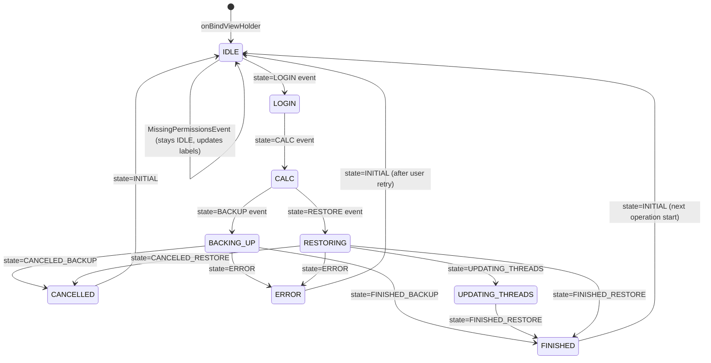

# Screen Specification: StatusPreference

**SCR ID:** SCR-SP-001
**Screen:** StatusPreference — Status Display + Backup/Restore Control Widget
**Source Application:** SMS Backup+
**Complexity:** High
**Priority:** P1 Critical
**Last Updated:** 2026-05-29

---

## Section 1: Screen Identity & User Story

**As a** device owner viewing the main settings screen,
**I want to** see at a glance whether a backup or restore is in progress (with progress details), and have a single button to start, stop, or monitor the operation,
**So that** I can trigger backups, cancel running operations, and understand what the app is doing without opening any secondary screen.

```gherkin
Feature: StatusPreference Widget

  Background:
    Given the user is on the main settings screen
    And the StatusPreference widget is visible

  Scenario: Idle state — no recent backup
    Given no backup has ever been performed
    When the preference is bound (onBindViewHolder)
    Then status icon shows the "done" (idle) drawable tinted with idleColor
    Then status label shows "Idle" in idleColor
    Then details label shows "Last item backed up: never"
    Then backup button shows "Backup" and is enabled
    Then restore button shows "Restore" and is enabled
    Then progress bar is at 0, not indeterminate

  Scenario: Idle state — after previous backup
    Given the most recent synced date is a stored timestamp T
    When the preference is bound
    Then details label shows "Last item backed up: {formatted date T}"

  Scenario: Login phase during backup
    Given a manual backup has started
    When backupStateChanged fires with state=LOGIN
    Then status icon tinted syncingColor with "syncing" drawable
    Then status label shows "Working" in syncingColor
    Then details label shows "Logging in…"
    Then progress bar is indeterminate

  Scenario: Calculation phase
    Given state=CALC received
    Then status label shows "Working"
    Then details label shows "Calculating…"
    Then progress bar is indeterminate

  Scenario: Active backup in progress
    Given state=BACKUP received with currentSyncedItems=5, itemsToSync=20
    Then restore button is disabled
    Then backup button label changes to "Stop"
    Then status label shows "Backing up"
    Then details label shows the notification label from BackupState
    Then progress bar is determinate with progress=5, max=20

  Scenario: Backup cancelled by user
    Given backup is running
    When user taps "Stop"
    Then backup button label changes to "Stopping" and is disabled
    And CancelEvent is posted to Otto bus
    When state=CANCELED_BACKUP is received
    Then status label shows "Canceled"
    Then details label shows "{N}/{M} items successfully backed up."
    Then buttons are restored to default state

  Scenario: Backup finished — items backed up
    Given state=FINISHED_BACKUP received with currentSyncedItems=7, maxItemsPerSync=500
    Then status label shows "Done" in doneColor
    Then status icon shows "done" drawable in doneColor
    Then details label shows "Successfully backed up 7 items."

  Scenario: Backup finished — max items reached
    Given state=FINISHED_BACKUP received AND currentSyncedItems == maxItemsPerSync (e.g., 100)
    Then details label shows "Maximum of 100 items per backup reached. Restart backup to continue."

  Scenario: Backup finished — no items
    Given state=FINISHED_BACKUP received with currentSyncedItems=0
    Then details label shows "There were no items to backup."

  Scenario: Active restore in progress
    Given state=RESTORE received with currentRestoredCount=3, itemsToRestore=15
    Then backup button is disabled
    Then restore button label changes to "Stop"
    Then status label shows "Restoring"
    Then details label shows the restore notification label
    Then progress bar is determinate with progress=3, max=15

  Scenario: Restore cancelled
    Given state=CANCELED_RESTORE received with currentRestoredCount=3, itemsToRestore=15
    Then status label shows "Canceled"
    Then details label shows "3/15 items successfully restored."
    Then buttons restored to default state (via setViewAttributes default branch)

  Scenario: Restore updating threads
    Given state=UPDATING_THREADS received
    Then progress bar is indeterminate
    Then details label shows "Updating threads…"

  Scenario: Restore finished
    Given state=FINISHED_RESTORE received with actualRestoredCount=10, duplicateCount=2
    Then status label shows "Done" in doneColor
    Then status icon shows "done" drawable in doneColor
    Then details label shows "Successfully restored 10 items (2 dups)."

  Scenario: Error — authentication failure — XOAuth mode
    Given state=ERROR received AND isAuthException()=true
    And authPreferences.useXOAuth()=true
    Then status label shows "Login error"
    Then details label shows "XOAuth authorization error. Please make sure you enabled IMAP in your Gmail account settings."

  Scenario: Error — authentication failure — plain mode
    Given state=ERROR received AND isAuthException()=true
    And authPreferences.useXOAuth()=false
    Then status label shows "Login error"
    Then details label shows "IMAP authorization error.\n  Make sure login and password are set correctly."

  Scenario: Error — permission problem
    Given state=ERROR received AND isPermissionException()=true
    Then status label shows "Permission problem"
    Then details label shows formatted missing permission names (e.g., "The following permissions are required: Access SMS Messages, Access Call Log.")

  Scenario: Error — unknown error
    Given state=ERROR received AND not auth AND not permission
    Then status label shows "Error"
    Then details label shows "Error during backup/restore:\n{error message or N/A}"

  Scenario: Missing permissions event from Otto bus
    Given MissingPermissionsEvent received with a list of AppPermission values
    Then status label shows "Permission problem"
    Then details label shows formatted permission names

  Scenario: Background backup — widget does NOT update
    Given a background (non-manual) backup is in progress
    When backupStateChanged fires with backupType.isBackground()=true
    Then the widget ignores the event (early return)
    And buttons remain in their current state
```

---

## Section 2: Screen Layout

StatusPreference is a custom `Preference` whose layout is `@layout/status` (status.xml). It renders as a single item in the preference list.

```
+---------------------------------------------+
| [ICON]  STATUS LABEL (bold, 16sp)           |
|         +-----------------------------------+|
|         | [PROGRESS BAR — full width]       ||
|         | Details label text                ||
|         +-----------------------------------+|
|         [BACKUP BUTTON]  [RESTORE BUTTON]   |
+---------------------------------------------+
```

Detailed layout from status.xml:

```
LinearLayout (vertical, padding 10dp all sides)
  RelativeLayout
    ImageView @id/status_icon (left-aligned, wrap_content)
    TextView @id/status_label (bold, 16sp, to right of icon, fills width)
    LinearLayout @id/details_sync (vertical, below icon, aligned with label)
      ProgressBar @id/details_sync_progress (horizontal style, full width, padding-right 10dp)
      TextView @id/details_sync_label (full width, margin-top 6dp)
  TableLayout (shrinkColumns=*, stretchColumns=*)
    TableRow
      Button @id/sync_button (gravity=center, buttonBarButtonStyle)
      Button @id/restore_button (gravity=center, buttonBarButtonStyle)
```

**Layout semantics:**

| Section | Layout Type | Scroll Behavior | Notes |
|---------|-------------|-----------------|-------|
| Status row | RelativeLayout | No scroll (fixed height) | Icon + label + progress + detail |
| Button row | TableLayout / TableRow | No scroll | Two equal-width buttons |
| Container | LinearLayout (vertical) | No scroll | Contained within PreferenceFragmentCompat recycler |

**Component placement (top to bottom):**

| Order | Component ID | Section | Width | Alignment |
|-------|--------------|---------|-------|-----------|
| 1 | status_icon | Status row | wrap_content | Left |
| 2 | status_label | Status row | fill_parent | Right of icon |
| 3 | details_sync_progress | Details sub-row | fill_parent | Below icon |
| 4 | details_sync_label | Details sub-row | fill_parent | Below progress |
| 5 | sync_button ("Backup") | Button row | 50% | Left half |
| 6 | restore_button ("Restore") | Button row | 50% | Right half |

---

## Section 3: Field Inventory

### 3.1 Input Fields

| Field ID | Label | Type | Required | Validation | Default | Placeholder | Notes |
|----------|-------|------|----------|------------|---------|-------------|-------|
| sync_button | "Backup" | Button | N/A | N/A | Enabled | — | Label changes to "Stop" or "Stopping" |
| restore_button | "Restore" | Button | N/A | N/A | Enabled | — | Label changes to "Stop" or "Stopping" |

### 3.2 Display Fields

| Field ID | Label | Data Type | Source | Format | Update Trigger |
|----------|-------|-----------|--------|--------|----------------|
| status_icon | — | Drawable | SmsSyncState enum | Tinted vector drawable | stateChanged() call |
| status_label | — | string | SmsSyncState + error type | Resource string | stateChanged(), finishedBackup(), finishedRestore(), idle(), onAuthFailed(), displayMissingPermissions() |
| details_sync_label | — | string | BackupState / RestoreState / preference | Resource string (some formatted) | Each state change |
| details_sync_progress | — | int/boolean | BackupState.currentSyncedItems, itemsToSync / RestoreState.currentRestoredCount, itemsToRestore | Integer progress, 0..max | BACKUP/RESTORE state update |

### 3.3 Validation Rules

No user-input validation on this widget.

### 3.4 State Controllers

```yaml
state_controllers:
  - field_id: sync_button
    trigger: SmsBackupService working state OR state machine event
    trigger_source: onBindViewHolder registers click; backupStateChanged / stateChanged / setViewAttributes
    conditions:
      - when: SmsBackupService.isServiceWorking() == true (on click)
        effects:
          value: post CancelEvent
          label: "Stopping"
          enabled: false
      - when: SmsBackupService.isServiceWorking() == false (on click)
        effects:
          value: post PerformAction(Backup, confirmAction())
      - when: state == BACKUP (received from bus)
        effects:
          label: "Stop"
          enabled: true
          opposite_button_enabled: false
      - when: state in [CANCELED_BACKUP, FINISHED_BACKUP, ERROR, INITIAL, default]
        effects:
          label: "Backup"
          enabled: true
    pseudocode: |
      ON sync_button clicked:
        IF SmsBackupService.isServiceWorking():
          sync_button.setText("Stopping")
          sync_button.setEnabled(false)
          post(CancelEvent)
        ELSE:
          post(PerformAction(Backup, preferences.confirmAction()))

  - field_id: restore_button
    trigger: SmsRestoreService idle state OR state machine event
    trigger_source: onRestore() on click; restoreStateChanged / stateChanged / setViewAttributes
    conditions:
      - when: SmsRestoreService.isServiceIdle() == true (on click)
        effects:
          value: post PerformAction(Restore, confirmAction())
      - when: SmsRestoreService.isServiceIdle() == false (on click)
        effects:
          label: "Stopping"
          enabled: false
          value: post CancelEvent
      - when: state == RESTORE (received from bus)
        effects:
          label: "Stop"
          enabled: true
          opposite_button_enabled: false
      - when: state in terminal states
        effects:
          label: "Restore"
          enabled: true
    pseudocode: |
      ON restore_button clicked:
        IF SmsRestoreService.isServiceIdle():
          post(PerformAction(Restore, preferences.confirmAction()))
        ELSE:
          restore_button.setText("Stopping")
          restore_button.setEnabled(false)
          post(CancelEvent)

  - field_id: status_icon_and_color
    trigger: SmsSyncState change
    trigger_source: setViewAttributes(SmsSyncState)
    conditions:
      - when: state IN [LOGIN, CALC, BACKUP, RESTORE]
        effects:
          icon: syncingDrawable (ic_syncing) tinted syncingColor
          label_color: syncingColor
      - when: state == ERROR
        effects:
          icon: errorDrawable (ic_syncing_problem) tinted errorColor
          label_color: errorColor
          progress: 0, not indeterminate
          buttons: default (both enabled, default labels)
      - when: state in all other states (INITIAL, FINISHED_BACKUP, FINISHED_RESTORE, CANCELED_*)
        effects:
          icon: idleDrawable (ic_done) tinted idleColor
          label_color: idleColor
          progress: 0, not indeterminate
          buttons: default
    pseudocode: |
      FUNCTION setViewAttributes(state: SmsSyncState):
        IF state IN [LOGIN, CALC, BACKUP, RESTORE]:
          statusLabel.textColor = syncingColor
          statusIcon.drawable = syncing
        ELSE IF state == ERROR:
          progressBar.progress = 0
          progressBar.indeterminate = false
          statusLabel.textColor = errorColor
          statusIcon.drawable = error
          setButtonsToDefault()
        ELSE:
          progressBar.progress = 0
          progressBar.indeterminate = false
          statusLabel.textColor = idleColor
          statusIcon.drawable = idle
          setButtonsToDefault()

  - field_id: progress_bar
    trigger: BACKUP or RESTORE state update
    trigger_source: backupStateChanged(BACKUP), restoreStateChanged(RESTORE), stateChanged(LOGIN/CALC)
    conditions:
      - when: state == BACKUP
        effects:
          indeterminate: false
          progress: BackupState.currentSyncedItems
          max: BackupState.itemsToSync
      - when: state == RESTORE
        effects:
          indeterminate: false
          progress: RestoreState.currentRestoredCount
          max: RestoreState.itemsToRestore
      - when: state IN [LOGIN, CALC, UPDATING_THREADS]
        effects:
          indeterminate: true
      - when: state IN [ERROR, INITIAL, FINISHED_*, CANCELED_*]
        effects:
          indeterminate: false
          progress: 0
```

---

## Section 4: Actions & Behaviors

### 4.1 User Actions

| Action ID | Element | Label (exact) | Preconditions | Behavior | Post-Action |
|-----------|---------|--------------|---------------|----------|-------------|
| ACT-SP-001 | sync_button | "Backup" (idle) | SmsBackupService not working | Post PerformAction(Backup, confirmAction()) to Otto bus | Button state unchanged until PerformAction response |
| ACT-SP-002 | sync_button | "Stop" (backup active) | SmsBackupService is working | Post CancelEvent; change button to "Stopping", disable | Button re-enabled on next state update |
| ACT-SP-003 | restore_button | "Restore" (idle) | SmsRestoreService is idle | Post PerformAction(Restore, confirmAction()) | Button state unchanged until response |
| ACT-SP-004 | restore_button | "Stop" (restore active) | SmsRestoreService not idle | Post CancelEvent; change button to "Stopping", disable | Button re-enabled on next state update |

### 4.2 System Actions

| Action ID | Trigger | Behavior | Frequency |
|-----------|---------|----------|-----------|
| SYS-SP-001 | onBindViewHolder | Binds all view references; calls idle() for initial display; registers Otto bus | Each time ViewHolder is bound (RecyclerView scroll or fragment attach) |
| SYS-SP-002 | onDetached | App.unregister(this) — unsubscribes from Otto bus | When preference detached from hierarchy |
| SYS-SP-003 | backupStateChanged(BackupState) | Update UI per state machine; ignore if backupType.isBackground() | Each BackupState Otto event |
| SYS-SP-004 | restoreStateChanged(RestoreState) | Update UI per state machine | Each RestoreState Otto event |
| SYS-SP-005 | onMissingPermissions(MissingPermissionsEvent) | Display permission problem in status area | Each MissingPermissionsEvent |

---

## Section 5: State Management

### 5.1 Screen States

| State | Entry Condition | Visual | Exit Condition |
|-------|-----------------|--------|----------------|
| IDLE | onBindViewHolder OR state=INITIAL | Done icon (idleColor), "Idle", last-backup date, both buttons enabled | Backup or restore starts |
| LOGIN | state=LOGIN event | Syncing icon (syncingColor), "Working", "Logging in…", indeterminate progress | State advances to CALC or BACKUP |
| CALCULATING | state=CALC event | "Working", "Calculating…", indeterminate | State advances to BACKUP or RESTORE |
| BACKING_UP | state=BACKUP event | "Backing up", determinate progress, restore disabled, backup="Stop" | FINISHED_BACKUP or CANCELED_BACKUP or ERROR |
| RESTORING | state=RESTORE event | "Restoring", determinate progress, backup disabled, restore="Stop" | FINISHED_RESTORE or CANCELED_RESTORE or ERROR |
| UPDATING_THREADS | state=UPDATING_THREADS event | Indeterminate progress, "Updating threads…" | State advances to FINISHED_RESTORE |
| FINISHED | state=FINISHED_BACKUP or FINISHED_RESTORE | Done icon (doneColor), "Done", success count details | Next action or screen re-creation |
| CANCELLED | state=CANCELED_BACKUP or CANCELED_RESTORE | Idle icon, "Canceled", partial count details, buttons default | Next action |
| ERROR_AUTH | state=ERROR AND isAuthException() | Error icon (errorColor), "Login error", auth-specific message, buttons default | Next action |
| ERROR_PERMISSION | state=ERROR AND isPermissionException() | Error icon, "Permission problem", permission list | Next action |
| ERROR_UNKNOWN | state=ERROR AND other | Error icon, "Error", "Error during backup/restore:\n{msg}" | Next action |

### 5.2 Local State Variables

| Variable | Type | Initial Value | Purpose | Persisted |
|----------|------|---------------|---------|-----------|
| backupButton | Button | null until onBindViewHolder | Reference to "Backup"/"Stop" button | No |
| restoreButton | Button | null until onBindViewHolder | Reference to "Restore"/"Stop" button | No |
| statusIcon | ImageView | null until onBindViewHolder | Status icon image | No |
| statusLabel | TextView | null until onBindViewHolder | Main status text | No |
| syncDetailsLabel | TextView | null until onBindViewHolder | Detail text line | No |
| progressBar | ProgressBar | null until onBindViewHolder | Sync progress | No |
| preferences | Preferences | Constructed in constructor | Access to max_items_per_sync, confirm_action, last sync dates | No |
| idleColor, doneColor, errorColor, syncingColor | int (color) | From XML theme attributes in constructor | Themed status colors | No |
| idle, done, error, syncing | Drawable | Tinted in constructor | Pre-built tinted drawables | No |

**CRITICAL NOTE:** `onSaveInstanceState` and `onRestoreInstanceState` are explicitly stubbed with `// TODO implement`. This means the widget loses its displayed state on device rotation or process death. The last state received via Otto bus is not re-delivered after rotation unless `@Produce` in the service fires again.

### 5.3 Global State Dependencies

| State Path | Read/Write | Purpose |
|------------|------------|---------|
| App.bus (Otto) | Read/Write | Subscribe to BackupState, RestoreState, MissingPermissionsEvent; post PerformAction, CancelEvent |
| Preferences.getDataTypePreferences().getMostRecentSyncedDate() | Read | Display "Last item backed up" timestamp in idle state |
| Preferences.getMaxItemsPerSync() | Read | Compare against currentSyncedItems to detect max-per-sync completion |
| Preferences.confirmAction() | Read | Pass to PerformAction event |
| SmsBackupService.isServiceWorking() | Read | Determine backup button label/action on tap |
| SmsRestoreService.isServiceIdle() | Read | Determine restore button label/action on tap |
| AuthPreferences.useXOAuth() | Read | Select correct auth error message |

---

## Section 6: Business Logic

### 6.1 Business Rules

| Rule ID | Name | Description | Applies To |
|---------|------|-------------|------------|
| BR-SP-001 | Background backup filtering | Status widget does not update for background backups; only manual/skip backups affect UI | backupStateChanged() |
| BR-SP-002 | Max-per-sync detection | If backedUpCount == preferences.getMaxItemsPerSync(), show "Maximum reached" message | finishedBackup() |
| BR-SP-003 | Cancel dual-use button | Backup and restore buttons act as both initiators and stop controls depending on service state | onClick() |
| BR-SP-004 | Auth error message selection | XOAuth vs plain auth error messages differ | onAuthFailed() |
| BR-SP-005 | Idle timestamp display | Uses the most recent across all data types (getMostRecentSyncedDate) | idle() |

### 6.2 Calculation Logic

```
// Rule: finishedBackup (BR-SP-002)
FUNCTION finishedBackup(state: BackupState, maxItemsPerSync: Int):
  backedUpCount = state.currentSyncedItems
  text: String = null

  IF backedUpCount == maxItemsPerSync:
    text = "Maximum of {backedUpCount} items per backup reached. Restart backup to continue."
  ELSE IF backedUpCount > 0:
    text = pluralString("Successfully backed up {backedUpCount} item(s).")
  ELSE IF backedUpCount == 0:
    text = "There were no items to backup."

  syncDetailsLabel.text = text
  statusLabel.text = "Done"
  statusLabel.textColor = doneColor
  statusIcon.drawable = done
END FUNCTION

// Rule: getLastSyncText (BR-SP-005)
FUNCTION getLastSyncText(lastSync: Long): String
  IF lastSync < 0:
    RETURN "Last item backed up: never"
  ELSE:
    RETURN "Last item backed up: {DateFormat.getDateTimeInstance().format(Date(lastSync))}"
END FUNCTION

// Rule: displayMissingPermissions (BR-SP-004 related)
FUNCTION displayMissingPermissions(permissions: List<AppPermission>):
  statusLabel.text = "Permission problem"
  names = permissions.map { resources.getString(it.descriptionResource) }
  count = names.size
  IF count == 1:
    syncDetailsLabel.text = "The following permission is required: {names[0]}."
  ELSE:
    syncDetailsLabel.text = "The following permissions are required: {join(names, ", ")}."
END FUNCTION
```

### 6.3 Portability Assessment

| Logic Area | Portability | Notes |
|------------|-------------|-------|
| Status label text selection | High | Pure switch on enum state |
| Progress bar updates | High | Standard progress model |
| finishedBackup plural logic | High | Any pluralization API |
| Otto bus subscription | Low | Platform-specific; replace with Flow/StateFlow |
| Tinted drawable construction | Medium | Vector tinting is Android-specific; CSS/SF equivalent exists on other platforms |
| SmsBackupService.isServiceWorking() static call | Low | Android Service static state; replace with ViewModel-exposed state |

---

## Section 7: Data Contracts

### 7.1 API Endpoints

No external API calls. Data consumed via Otto bus events (internal IPC).

### 7.2 Internal Event Contracts (replacing API section)

**BackupState fields consumed:**
- `state: SmsSyncState` — drives switch/case rendering
- `backupType: BackupType` — `isBackground()` gate; used to filter non-manual backups
- `currentSyncedItems: int` — progress bar current value and completion text
- `itemsToSync: int` — progress bar max value
- `getNotificationLabel(Resources): String` — detail text during BACKUP state
- `isAuthException(): Boolean` — error categorization
- `isPermissionException(): Boolean` — error categorization
- `getMissingPermissions(): String[]` — for permission error display
- `getErrorMessage(Resources): String` — for unknown error display

**RestoreState fields consumed:**
- `state: SmsSyncState`
- `currentRestoredCount: int`
- `itemsToRestore: int`
- `actualRestoredCount: int` — used in FINISHED_RESTORE display
- `duplicateCount: int` — used in FINISHED_RESTORE display
- `getNotificationLabel(Resources): String`

### 7.4 Entity References

| Entity | Fields Used | Reference |
|--------|-------------|-----------|
| SmsSyncState | All 11 enum values | app/src/main/java/com/zegoggles/smssync/service/state/SmsSyncState.java |
| BackupState | state, backupType, currentSyncedItems, itemsToSync, getNotificationLabel, isAuthException, isPermissionException, getMissingPermissions, getErrorMessage | app/src/main/java/com/zegoggles/smssync/service/state/BackupState.java |
| RestoreState | state, currentRestoredCount, itemsToRestore, actualRestoredCount, duplicateCount, getNotificationLabel | app/src/main/java/com/zegoggles/smssync/service/state/RestoreState.java |

---

## Section 8: Navigation

### 8.1 Entry Points

This is a non-navigable widget — it is embedded in `MainSettings` (root preference fragment of `MainActivity`). It has no entry points of its own.

### 8.2 Exit Points

No navigation exits. The widget posts events to Otto bus; `MainActivity` handles the resulting navigation.

### 8.3 Back Stack Behavior

N/A — this widget does not participate in the navigation back stack.

---

## Section 9: Conditional Display Logic

### 9.1 Visibility Rules

| Element ID | Condition | When True | When False |
|------------|-----------|-----------|------------|
| sync_button enabled | state not in [RESTORE, CALC, LOGIN, UPDATING_THREADS] AND not waiting for cancel | Enabled | Disabled |
| restore_button enabled | state not in [BACKUP, CALC, LOGIN] AND not waiting for cancel | Enabled | Disabled |
| progress bar (indeterminate) | state IN [LOGIN, CALC, UPDATING_THREADS] | Indeterminate spinner | Determinate bar |
| progress bar (determinate) | state IN [BACKUP, RESTORE] | progress/max set | progress=0 |
| Widget updates | backupState event with backupType.isBackground()=true | IGNORED (early return) | Widget updates normally |

### 9.2 Permission Matrix

Single-user app; no role-based access control. All UI is accessible to device owner.

---

## Section 10: Error Handling

### 10.1 Error States

| Error Type | Trigger | User Message (exact) | Recovery Action |
|------------|---------|----------------------|-----------------|
| Auth failure (XOAuth mode) | state=ERROR AND isAuthException() AND useXOAuth() | Status: "Login error" / Details: "XOAuth authorization error. Please make sure you enabled IMAP in your Gmail account settings." | User must update auth settings |
| Auth failure (plain mode) | state=ERROR AND isAuthException() AND !useXOAuth() | Status: "Login error" / Details: "IMAP authorization error.\n  Make sure login and password are set correctly." | User must update credentials |
| Permission problem (from state) | state=ERROR AND isPermissionException() | Status: "Permission problem" / Details: pluralized permission list | User grants permissions |
| Permission problem (from event) | MissingPermissionsEvent received | Same as above | Same |
| Unknown error | state=ERROR AND none of above | Status: "Error" / Details: "Error during backup/restore:\n{errorMessage or N/A}" | Retry or check logs |

### 10.2 Error Display Patterns

| Error Type | Display Location | Style | Duration |
|------------|-----------------|-------|----------|
| All error states | Inline in StatusPreference (status_label + details_sync_label + error icon) | Inline text with errorColor tinting | Until next state change or new Otto event |

---

## Section 11: Loading States

| State | Trigger | Display | Duration |
|-------|---------|---------|----------|
| LOGIN | state=LOGIN BackupState or RestoreState | "Working" + "Logging in…" + indeterminate progress | Until CALC or BACKUP/RESTORE state |
| CALC | state=CALC | "Working" + "Calculating…" + indeterminate | Until BACKUP or RESTORE state |
| BACKUP | state=BACKUP | "Backing up" + determinate progress + restore disabled | Until FINISHED/CANCELED/ERROR |
| RESTORE | state=RESTORE | "Restoring" + determinate progress + backup disabled | Until FINISHED/CANCELED/ERROR |
| UPDATING_THREADS | state=UPDATING_THREADS | Indeterminate progress + "Updating threads…" | Until FINISHED_RESTORE |
| Canceling | User taps "Stop" while service is working | Button text "Stopping", button disabled | Until next state event |

---

## Section 12: Accessibility Requirements

**Finding:** No explicit accessibility attributes in StatusPreference.java or status.xml.

| Element | Required Label | Required Hint | Role |
|---------|---------------|---------------|------|
| status_icon | contentDescription = "Status: {state name}" (dynamic) | — | ImageView (should be decorative if label adjacent) |
| status_label | No separate label needed (it IS the label) | — | TextView |
| sync_button | Accessible label = button text (dynamic: "Backup"/"Stop"/"Stopping") | "Tap to start or stop backup" | Button |
| restore_button | Accessible label = button text | "Tap to start or stop restore" | Button |
| details_sync_progress | contentDescription = "Backup progress {current} of {max}" | — | ProgressBar |
| details_sync_label | No separate label | — | TextView |

General requirements:

| Requirement | Implementation |
|-------------|----------------|
| Touch targets | Buttons should be >= 44dp tall; buttonBarButtonStyle typically meets this |
| Color alone | Status is NOT conveyed by color alone — text label accompanies every color change |
| Focus order | Default top-to-bottom focus: icon (skip) → label → details → progress → backup button → restore button |

---

## Section 13: Analytics Events

No analytics. N/A — no analytics SDK in source.

---

## Section 14: Test Scenarios

### 14.1 Happy Path Tests

```gherkin
Scenario: Widget shows idle state with last backup date
  Given the most recent synced timestamp is 1700000000000
  When onBindViewHolder is called
  Then status_label shows "Idle"
  And details_sync_label shows "Last item backed up: {formatted date}"
  And sync_button is "Backup" and enabled
  And restore_button is "Restore" and enabled
  And progressBar progress is 0

Scenario: Backup progresses from LOGIN to BACKUP
  Given the widget is bound
  When backupStateChanged fires with state=LOGIN
  Then status_label shows "Working"
  And details_sync_label shows "Logging in…"
  And progressBar is indeterminate
  When backupStateChanged fires with state=BACKUP, currentSyncedItems=3, itemsToSync=10
  Then sync_button label is "Stop"
  And restore_button is disabled
  And progressBar progress=3, max=10

Scenario: Backup completes normally
  Given state=BACKUP was received
  When backupStateChanged fires with state=FINISHED_BACKUP, currentSyncedItems=5, maxItemsPerSync=500
  Then status_label shows "Done"
  And status_label textColor is doneColor
  And details_sync_label shows "Successfully backed up 5 items."
  And both buttons are re-enabled with default labels
```

### 14.2 Validation Tests

```gherkin
Scenario: Background backup event does not update widget
  Given a background backup is running
  When backupStateChanged fires with backupType.isBackground()=true
  Then the widget state is unchanged
  And no UI elements are modified

Scenario: Cancellation disables button until next state
  Given state=BACKUP is active
  When user taps the "Stop" button
  Then sync_button text becomes "Stopping"
  And sync_button is disabled
  And CancelEvent is posted
  When backupStateChanged fires with state=CANCELED_BACKUP
  Then sync_button is re-enabled with label "Backup"
```

### 14.3 Edge Cases

| Case | Setup | Action | Expected Result |
|------|-------|--------|-----------------|
| Rotation while BACKUP active | state=BACKUP in progress, widget bound | Device rotated | Widget re-binds to IDLE (onSaveInstanceState is TODO/stub); does NOT restore BACKUP state until next Otto bus event |
| maxItemsPerSync exactly reached | FINISHED_BACKUP, currentSyncedItems==maxItemsPerSync==100 | State received | details shows "Maximum of 100 items per backup reached. Restart backup to continue." |
| Zero items backed up | FINISHED_BACKUP, currentSyncedItems=0 | State received | details shows "There were no items to backup." |
| Multiple rapid taps on Backup | User taps Backup quickly twice | onClick x2 | First tap posts PerformAction; second tap also posts (no debounce in source) |
| MissingPermissionsEvent with empty list | MissingPermissionsEvent([]) received | Event received | statusLabel="Permission problem"; details shows "The following permissions are required: ." (empty join) |
| Duplicate count zero in restore | FINISHED_RESTORE, actualRestoredCount=5, duplicateCount=0 | State received | "Successfully restored 5 items (0 dups)." |
| Widget detached before state event | onDetached() called, then backupStateChanged fires | Event received | App.unregister called; event not received (Otto unregistered); no NPE |
| State ERROR with null errorMessage | state=ERROR, getErrorMessage()=null | State received | details shows "Error during backup/restore:\nN/A" |

---

## Section 15: Source References

| File | Role |
|------|------|
| `app/src/main/java/com/zegoggles/smssync/activity/StatusPreference.java` | Primary component |
| `app/src/main/java/com/zegoggles/smssync/service/state/SmsSyncState.java` | State enum (11 values) |
| `app/src/main/java/com/zegoggles/smssync/service/state/BackupState.java` | Backup state value object |
| `app/src/main/java/com/zegoggles/smssync/service/state/RestoreState.java` | Restore state value object |
| `app/src/main/java/com/zegoggles/smssync/service/state/State.java` | Base state class with error/auth/permission helpers |
| `app/src/main/java/com/zegoggles/smssync/service/CancelEvent.java` | Cancel event POJO |
| `app/src/main/java/com/zegoggles/smssync/activity/AppPermission.java` | Permission enum |
| `app/src/main/java/com/zegoggles/smssync/activity/events/MissingPermissionsEvent.java` | Permission event POJO |
| `app/src/main/java/com/zegoggles/smssync/activity/events/PerformAction.java` | Action event POJO |
| `app/src/main/res/layout/status.xml` | View layout |
| `app/src/main/res/values/strings.xml` | All user-visible string resources |

---

## Section 16: Feature Flags & Configuration

| Flag/Config | Source | Default | Effect When Enabled | Effect When Disabled |
|-------------|--------|---------|---------------------|---------------------|
| confirm_action (key: "confirm_action") | SharedPreferences | false | PerformAction events carry confirm=true; MainActivity shows confirm dialog | Actions execute directly |
| max_items_per_sync | SharedPreferences | -1 (all) | Compared against currentSyncedItems in finishedBackup() | If -1, max-per-sync message never shown (backedUpCount != -1 in practice) |
| dark_theme | SharedPreferences | false | Colors sourced from dark theme attribute | Colors from light theme attribute |

---

## Section 17: Modals, Drawers & Overlays

This widget does not manage any modals directly. It posts events to the Otto bus; `MainActivity` manages all modal dialogs in response.

---

## Section 18: Local Storage & Caching

| Key | Storage Type | Data Shape | Read When | Write When | Expiry |
|-----|-------------|------------|-----------|------------|--------|
| max_items_per_sync | SharedPreferences (default) | int stored as string | finishedBackup() comparison | User changes preference | Never |
| max_synced_date per DataType | SharedPreferences (default) | long (epoch ms) | idle() → getMostRecentSyncedDate() | After successful backup | Never |

---

## Section 19: State Machine Diagrams



---

## Section 20: Implementation Notes

### 20.1 Known Complexity Areas
- **Instance state not saved:** `onSaveInstanceState` / `onRestoreInstanceState` are explicitly `// TODO implement`. On rotation, the widget reverts to IDLE state. This is a known bug. The @Produce annotation on SmsBackupService/SmsRestoreService partially mitigates this by re-delivering the last-known state to late Otto subscribers.
- **View reference NPE risk:** `backupButton`, `restoreButton`, etc. are set in `onBindViewHolder` but the `@Subscribe` methods can be called at any time after `onBindViewHolder`. If Otto delivers an event before the view is bound (unlikely but possible during initialization), a NullPointerException would occur.
- **Double-role button pattern:** The same button serves as both "start" and "stop" depending on service state. The service state is queried synchronously at click time via static methods, which is a threading concern.

### 20.2 Recommended Approach (Refactor-in-place)
- Replace Otto `@Subscribe` with a `StateFlow<SyncState>` exposed by a shared `SyncStateRepository`. Collect in `onBindViewHolder` using a coroutine scope tied to the Preference's lifecycle.
- Implement `onSaveInstanceState` / `onRestoreInstanceState` to persist the last rendered `SmsSyncState` and text values.
- Replace `SmsBackupService.isServiceWorking()` / `SmsRestoreService.isServiceIdle()` static calls with a `StateFlow<Boolean>` from the same repository.

### 20.3 Dependencies
- `SmsBackupService.isServiceWorking()` — static state query at click time
- `SmsRestoreService.isServiceIdle()` — static state query at click time
- `App.bus` — Otto bus for all event delivery
- `Preferences` — max_items_per_sync, confirmAction(), getMostRecentSyncedDate()
- `AuthPreferences` — useXOAuth() for error message selection

### 20.4 Technical Debt
- `onSaveInstanceState` / `onRestoreInstanceState` stubbed with TODO — UI state lost on rotation
- Static service state queries create hidden coupling between widget and service lifecycle
- No debounce on rapid button taps; multiple PerformAction events can be posted

### 20.5 Migration Considerations
- The 11-state SmsSyncState enum is the canonical state model. Any rewrite must preserve all 11 states.
- The color/drawable theming (four colors from XML attributes) must be re-implemented on the target platform using its theme system.
- Progress bar max is `itemsToSync` / `itemsToRestore` which may be 0 if count is not yet calculated — handle divide-by-zero / empty-max edge case.

---

## Screen Metrics

| Metric | Count |
|--------|-------|
| Input Fields | 2 (buttons) |
| Display Fields | 4 (icon, label, details, progress) |
| Actions (User) | 4 |
| Actions (System) | 5 |
| Screen States | 11 |
| State Controllers | 4 |
| Validation Rules | 0 |
| API Endpoints | 0 (Otto bus events) |
| Business Rules | 5 |
| Visibility Rules | 6 |
| Error Types | 5 |
| Loading States | 5 |
| Analytics Events | 0 |
| Test Scenarios | 10 |
| Modals/Drawers | 0 |

## Complexity Indicators

| Indicator | Value | Assessment |
|-----------|-------|------------|
| Total Fields | 6 | Medium |
| Dynamic Fields (conditional state) | 6 (all fields change dynamically) | High |
| Cross-Field Dependencies | 5 (state → button labels, colors, progress, text) | High |
| External Event Handlers | 3 (@Subscribe methods) | Medium |
| Custom Validation Rules | 0 | Low |
| Subcomponents | 0 | Low |
| Modals/Drawers | 0 | Low |

---

<!-- SELF-CHECK
Date: 2026-05-29
Checklist: 58/66
Gaps Found:
- Analytics: none; documented N/A with reason
- Navigation entry/exit: N/A for embedded widget; documented explicitly
- Instance state: gap documented as known technical debt
Result: READY FOR AUDIT
-->
